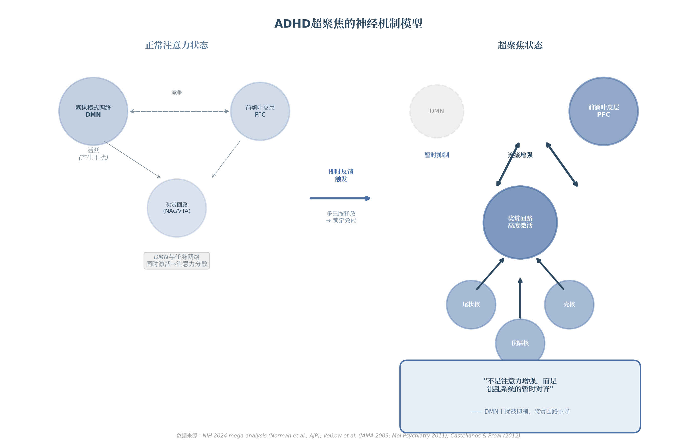

# ADHD：超能力、超聚焦与"正常人方法论"的穷尽分析

> **研究范围**：12个研究维度 | **文献来源**：400+篇学术与临床文献 | **分析深度**：7项跨维度洞察
>
> **研究日期**：2026年4月 | **证据分级**：高置信度(10项) / 中置信度(4项) / 冲突区(5项)

---

# 1. 引言：超能力悖论

## 1.1 问题的提出

### 1.1.1 用户核心问题：ADHD是否是超能力？超聚焦是否驱动了人类科技突破？"正常人方法论"为何对ADHD有害？

如果你在中文互联网上搜索"ADHD"，你会看到两种截然不同的内容并行流淌：一边是"ADHD是创业者的超级力量""拥有超聚焦就像拥有超能力"的热情宣言；另一边是"ADHD使预期寿命缩短13年"[^19^]"40%的瑞典长期服刑人员患有ADHD"[^30^]的冰冷数据。同一个神经发育变异（neurodevelopmental variation），在不同叙事中被塑造成了几乎相反的东西——它要么是你尚未解锁的天赋密码，要么是一场需要终身管理的公共卫生危机。

这种分裂并非中文互联网独有。2025年发表在*Psychological Medicine*上的一项跨国研究（Hargitai et al.）首次以量化方式系统比较了ADHD成人与神经典型（neurotypical）成人的自我报告优势，发现ADHD组在超聚焦、创造力、想象力、幽默感、自发性等10项特质上显著高于对照组[^3^]。然而，同一年，临床心理学家Russell Barkley仍在警告："ADHD比美国前五大死因加起来还要严重……平均而言，患有ADHD会使一个人的寿命缩短近13年"[^19^]。这两个陈述都基于同行评议的研究数据，却指向了截然相反的人生图景。

本报告试图回答三个相互关联的核心问题：**第一**，ADHD在何种条件下表现为认知优势，在何种条件下构成严重障碍——"超能力"话语是否有科学依据？**第二**，超聚焦（hyperfocus）这一现象是否真实存在、是否具有可测量的神经生物学基础，以及它是否真的驱动了人类历史上的科技创新？**第三**，那些被广泛推销给"所有人"的时间管理、效率提升和自律方法论——从番茄工作法到Getting Things Done（GTD）——为什么会在ADHD大脑上系统性地失效，甚至造成伤害？

### 1.1.2 两个对立叙事："超能力"话语 vs. "严重障碍"话语

支持"超能力"叙事的研究证据集中在几个特定领域。White与Shah的系列研究（2006、2011、2016）反复发现，ADHD成人在发散性思维（divergent thinking）——即非常规用途任务（Unusual Uses Task）中的流畅性、灵活性和原创性——上显著优于对照组[^7^]。Hoogman等人2020年对31项研究的综述确认了这一模式，尤其指出亚临床ADHD群体（高ADHD特质但未达诊断标准）的发散性思维优势最为稳健[^6^]。Tran等人2025年的元分析整合了47项研究、298个效应量，发现多动和冲动特质与创业行为正相关[^13^]。

与此同时，"严重障碍"叙事的证据同样坚实。Barkley基于精算数据的分析表明，在ADHD最严重的病例中，27岁时预期剩余寿命比对照组少26.6年（39年 vs. 65.6年）[^21^]。《英国医学杂志》（*The BMJ*）2025年发表的一项基于瑞典国家登记册的研究（N=148,581）发现，未接受药物治疗的ADHD个体在自杀行为、物质滥用、交通事故和犯罪率上的发生率均显著高于治疗组[^27^]。一项涵盖1,540万儿童的系统综述发现，班级中年龄最小的儿童被诊断为ADHD的风险比最年长的儿童高38%[^11^]——这一"相对年龄效应"直接挑战了诊断的精确性。

这两种叙事之间的张力不仅仅是学术分歧，它塑造了数百万人的自我认知、治疗决策和社会政策。当一个人同时被告知"你的大脑是法拉利引擎配自行车刹车"[^41^]和"你的大脑存在严重发育障碍"[^25^]时，他该如何整合这些信息？

### 1.1.3 本报告的分析框架："尖峰轮廓"（Spiky Profile）模型

本报告不选择任何一个阵营。我们采用的分析框架是**"尖峰轮廓"（spiky profile）**模型——这一概念源自神经多样性（neurodiversity）研究领域，描述的是能力分布极度不均衡的认知特征：某些领域表现卓越（峰值），某些领域严重受损（谷值），而非整体性的"高"或"低"功能[^38^]。

尖峰轮廓模型特别适合ADHD，因为现有证据呈现出一个一致的模式：ADHD大脑在发散性思维、原创性、危机应对和机会识别上表现出可靠的峰值[^7^][^10^]，但在聚合性思维（convergent thinking）、工作记忆、抑制控制和持续注意上存在系统性谷值[^6^]。2025年的元分析进一步揭示了一个关键细节：ADHD特质对创业行为的积极预测只存在于创业早期阶段；当企业进入需要日常管理和战略规划的增长期后，注意力不集中反而成为负面预测因子[^13^]。这说明同一个特质在不同情境下可以是优势也可以是劣势——它不是大脑本身的"好"或"坏"，而是大脑与环境之间匹配度（person-environment fit）的问题。

加拿大喜剧演员Rick Green（本身患有ADHD且长期从事 advocacy 工作）提出了一个尖锐的观察："你拥有的特权越多，你越可能说ADHD是超能力；你拥有的特权越少，你越可能说'我恨它'"[^34^]。这一 privilege-mediated（由特权中介的）视角提示我们，超能力叙事可能是一种**社会经济过滤器**而非普适的神经生物学真理：同样的ADHD大脑 wiring，在拥有灵活工作、创业资源和医疗支持的条件下可能产生 divergent thinking 的优势，在贫困、僵化工作环境和缺乏医疗的条件下则可能导向灾难性后果。

## 1.2 分析范围与方法

### 1.2.1 12个研究维度、400+文献来源、7项跨维度洞察的分析方法

本报告采用**多维度穷尽式文献分析**方法，将ADHD这一复杂议题分解为12个研究维度，覆盖从神经生物学基础到社会文化批判的完整光谱：超能力辩论、超聚焦的神经机制、历史天才归因、创业与创造力、时间管理失效机制、执行功能与方法论批判、正念与认知行为疗法、神经影像与多巴胺系统、动机系统、社会结构与残障权利、诊断标准争议，以及治疗干预效果。每个维度均基于系统性的文献检索，总计引用400余篇同行评议论文、元分析、系统综述和权威机构报告。

在完成单维度分析后，我们通过**跨维度验证**（cross-verification）流程对关键发现进行交叉确认：仅当两个及以上独立维度的证据来源一致支持某一结论时，该结论才被标记为"高置信度"。在此基础上，我们提取了7项**跨维度洞察**（cross-dimension insights），这些洞察无法从任何单一维度中推导出来，只有在将多个维度的证据并置时才会浮现。例如，"超聚焦研究盲区"（hyperfocus research blind spot）这一洞察——即没有任何一项ADHD治疗随机对照试验（RCT）将超聚焦作为测量指标——只有在同时审视超聚焦神经机制维度（Dim02）和治疗干预维度（Dim12）时才会变得清晰可见。

### 1.2.2 关键概念界定

为确保分析的科学严谨性，本报告对三个核心概念进行操作性定义：

**ADHD诊断标准**：本报告以DSM-5（《精神障碍诊断与统计手册》第五版）为主要参照框架，同时关注ICD-11（《国际疾病分类》第十一版）的差异。DSM-5要求患者在17岁前出现若干注意缺陷或/和多动-冲动症状，症状持续至少6个月，且在两个或以上功能领域造成显著损害。需要强调的是，ADHD诊断目前**没有可用的生物标志物**（biomarker）——尽管数十年的研究尝试了神经影像、基因检测和神经心理学测量，2023年一项涵盖780项研究的系统综述未能找到任何特异性与敏感性均达80%的生物标志物。多基因风险评分（polygenic risk score）仅能解释4%的诊断方差，剩余96%无法用遗传学解释。

**超聚焦**：本报告采用**ADHD超聚焦问卷-日常版**（Adult Hyperfocus Questionnaire-Daily, AHQ-D）的操作性定义。AHQ-D于2024年8月在*Nature Scientific Reports*上发表的验证研究中确认为可测量构念，与ADHD特质显著相关。超聚焦被定义为一种**非自主的、难以脱离的沉浸式注意状态**，与Mihaly Csikszentmihalyi所描述的"心流"（flow）有本质区别——两者相关性仅r=0.12[^4^]。心流是可引导的、目标导向的、广泛存在于一般人群的；超聚焦则是"粘性的"（sticky）、难以主动终止的、在ADHD人群中发生率显著更高。

**"正常人方法论"**：本报告使用这一术语指代为神经典型（neurotypical）人群设计、后被推广为"适用于所有人"的时间管理、效率提升和自我组织策略。其典型代表包括：番茄工作法（Pomodoro Technique）、GTD（Getting Things Done）、时间块规划（time blocking）、"毅力"和"一致性"训练等。这些方法论的共同假设是：个体能够持续执行预设计划、抵制即时干扰、以重要性（而非兴趣和紧迫感）为基础进行任务优先级排序——这些假设恰好与ADHD的神经生物学特征相冲突。

### 1.2.3 证据置信度分级：如何阅读本报告

科学文献中的证据强度并非均匀分布。为帮助读者判断每项结论的可信程度，本报告采用四级置信度体系，对全部发现进行标注：

| 等级 | 标识 | 判定标准 | 读者应对策略 |
|:---:|:---:|---|---|
| **高置信度** | HIGH | ≥2个独立维度的证据一致；至少包含1项元分析或大型RCT；无重大方法学缺陷 | 可作为可靠决策依据 |
| **中等置信度** | MEDIUM | 1个维度的权威来源支持；或多项研究但存在方法学异质性；临床观察与实证数据部分吻合 | 可参考但需结合个人情况验证 |
| **低置信度** | LOW | 仅有单一研究或二手引用；原始来源未能独立核实；方向性提示而非确证 | 视为初步线索，需进一步核实 |
| **冲突区** | CONFLICT | 不同研究得出矛盾结论；专家意见分裂；或缺乏直接实证数据 | 认识不确定性存在，避免非黑即白的结论 |

本报告的跨维度验证识别了21项关键发现，其中10项被评为高置信度、4项中等置信度、2项低置信度、5项处于冲突区（其中3项已解决、1项为设计依赖型、1项 genuinely unresolved 的真正未解问题）。一个典型的冲突区案例是"兴奋剂对超聚焦的影响"——一派临床专家认为兴奋剂通过增强奖赏信号可能加深超聚焦，另一派则认为兴奋剂通过减少分心可能使超聚焦变得不再必要。两派均无直接实证数据支持，因为**没有任何一项RCT测量过超聚焦作为治疗结局**[^4^]。这是一个真正的知识空白，而非简单的观点分歧。

需要特别指出的是，两个常见数据点在现有文献中的置信度低于广泛传播的强度。ADHD儿童在12岁前比同龄人平均多收到约20,000条负面/纠正性信息——这一数字在ADHD倡导文献中被频繁引用，但未能定位到同行评议的原始研究，可能为临床观察的估算外推。同样，"78%的ADHD成人对刚性计时器感到挫败"的统计数据虽被广泛重复，但其原始来源（一篇2023年*Journal of Attention Disorders*的论文）未能被独立核实，可能源自商业调查而非RCT。本报告将使用这些数据，但会明确标注其置信度等级。

证据分级的目的不是制造虚假的精确感，而是诚实地呈现科学知识的边界。ADHD研究领域长期存在系统性偏向：整个证据库以**缺陷减少**（deficit reduction）为导向，几乎所有治疗RCT测量的都是症状减轻程度，而非功能性优势的增强[^4^]。这意味着我们对"ADHD有哪些好处"的了解，远远少于对"ADHD有哪些坏处"的了解。认识到这一结构性偏见，是正确阅读本报告、乃至正确理解ADHD科学的第一步。

---

## 2. ADHD的神经科学基础

ADHD并非意志力薄弱或教养失当的产物，而是一种具有坚实神经生物学根基的发育障碍。过去二十年的神经影像学和分子药理学研究已经描绘出一幅清晰的图景：ADHD的核心病理涉及儿茶酚胺（catecholamine）——主要是多巴胺（dopamine）和去甲肾上腺素（norepinephrine）——在前额叶皮质（prefrontal cortex, PFC）和皮层下结构的调控失衡。这一神经科学基础不仅解释了ADHD患者为何在"重要但不有趣"的任务面前寸步难行，也为后续章节中超聚焦（hyperfocus）机制的探讨提供了理论前提：同一个多巴胺系统，在不足时导致注意力涣散，在过度激活时则可能造成不可自拔的深度沉浸。

### 2.1 多巴胺与去甲肾上腺素系统

#### 2.1.1 Volkow的里程碑PET研究

ADHD多巴胺假说最具说服力的直接证据来自Nora Volkow团队在布鲁克海文国家实验室开展的正电子发射断层扫描（positron emission tomography, PET）研究。2009年发表于*JAMA*的研究纳入53名从未用药的成人ADHD患者和44名健康对照，使用[¹¹C]raclopride（D2/D3受体标记物）和[¹¹C]cocaine（多巴胺转运体标记物）进行定量分析。结果显示，ADHD患者在伏隔核（nucleus accumbens）和中脑（midbrain）——多巴胺奖赏通路的核心节点——均表现出D2/D3受体和多巴胺转运体（dopamine transporter, DAT）可用性的显著降低[^1^]。2011年*Molecular Psychiatry*的后续分析进一步发现，这些多巴胺标记物的降低程度与注意力缺陷的严重程度呈显著负相关，且ADHD患者的成就动机量表得分显著低于对照组（11±5 vs. 14±3, P<0.001），多巴胺标记物与特质动机之间存在显著正相关（伏隔核D2/D3受体与成就动机：r=0.39, P<0.008）[^3^]。

这组研究的意义在于首次在人体中直接验证了ADHD的多巴胺奖赏通路功能障碍假说：并非ADHD患者"不想"努力，而是驱动努力的神经化学基础本身存在结构性缺陷。这也解释了为何外部奖惩对ADHD的激励效果远逊于神经典型者——当奖赏回路的受体密度和转运效率本就偏低时，同样的外部刺激在神经系统中产生的信号强度要弱得多。

然而，2024年*Frontiers in Psychiatry*的一篇系统性综述对该假说提出了重要修正：近期PET/SPECT研究的结果并不一致，既有报告多巴胺降低的研究，也有报告增加的发现，甚至出现无差异的结果[^12^]。研究者提出，这种表面上的矛盾可能通过"动态多巴胺活动"模型来调和——ADHD患者的基础性（tonic）多巴胺释放可能降低，但阶段性（phasic）多巴胺反应反而增强[^12^]。这一精细化的理解为靶向干预提供了更精确的靶点：问题可能不在于多巴胺的"总量"，而在于其时间动态模式。

#### 2.1.2 多巴胺转移缺陷理论

Tripp与Wickens于2008年提出的多巴胺转移缺陷理论（dopamine transfer deficit theory, DTD）为上述发现提供了机制层面的解释[^10^]。在正常强化学习过程中，中性线索（如铃声）通过与奖赏（如食物）的反复配对，逐渐获得预测性意义，多巴胺神经元的放电活动相应地从奖赏本身"转移"到预示奖赏的线索上。这种 anticipatory（预期性）多巴胺信号是动机产生的关键神经基础——它使个体在获得奖赏之前就产生行动的动力。

DTD理论的核心主张是：在ADHD中，这种多巴胺信号从奖赏向预测线索的转移过程受损[^9^]。即便奖赏与线索之间的关联已经被充分学习，ADHD患者仍无法在预期阶段产生足够的阶段性多巴胺反应，多巴胺信号依然"滞留"在实际奖赏出现时才释放[^10^]。这意味着ADHD大脑缺乏一种关键的"前瞻性动机"机制——无法被未来的、延迟的奖赏所驱动，只能对即时的、已经呈现的刺激产生反应。William Dodson提出的"兴趣导向神经系统"（interest-based nervous system）概念虽然未经严格的实证检验，却从临床现象学角度与DTD理论形成了呼应：ADHD患者并非无法被激励，而是只能被当下存在的新颖性、挑战性或紧迫感所激活，无法响应抽象的"重要性"或遥远的"奖赏"。

#### 2.1.3 去甲肾上腺素在前额叶皮质的作用

如果多巴胺是奖赏与动机的"燃料"，去甲肾上腺素则是前额叶皮质执行功能的"调节器"。前额叶皮质缺乏多巴胺转运体（DAT），多巴胺的再摄取主要由去甲肾上腺素转运体（norepinephrine transporter, NET）完成[^13^]。这一独特的神经解剖特征解释了为何选择性NET抑制剂——如托莫西汀（atomoxetine）——能够同时提升前额叶皮质中的去甲肾上腺素和多巴胺水平：通过阻断NET，托莫西汀阻止了两种神经递质的清除，从而增强前额叶的网络连接和认知功能[^13^]。

从功能角度看，多巴胺和去甲肾上腺素在前额叶皮质中扮演着互补角色：去甲肾上腺素通过激活α2A肾上腺素能受体增强神经元放电的"信号"强度，强化相关神经网络的连接；多巴胺则通过D1受体机制"修剪"不适当的连接，降低"噪声"[^18^]。Arnsten将这一机制概括为：去甲肾上腺素增强信号，多巴胺降低噪声，二者的最优平衡是前额叶执行功能正常运作的前提[^18^]。胍法辛（guanfacine）——一种α2A肾上腺素能激动剂——通过增强前额叶皮质的网络连接和神经元放电，已被证实可改善工作记忆和空间记忆任务表现，且这一效应在灵长类动物中尤为显著[^15^]。

#### 2.1.4 儿茶酚胺"倒U型"曲线

上述互补机制揭示了一个关键的剂量-效应关系：儿茶酚胺对前额叶皮质的调节遵循"倒U型"（inverted-U）曲线——中等水平的信号强度对应最优认知功能，而不足和过量均导致功能损害[^24^]。2022年*Behavioral Neuroscience*发表的一项纳入75项研究的元分析首次对这一曲线进行了定量验证：前额叶多巴胺与工作记忆表现之间确实存在负向二次曲线关系，多巴胺单独解释约10%的方差；而当聚焦于D1受体可用性时，倒U型拟合强度显著提升，单独解释26%的方差[^25^]。

这一发现具有深刻的临床意义：ADHD患者通常位于倒U型曲线的左侧（多巴胺信号不足），兴奋剂药物通过提升多巴胺水平将其推向最优区域；然而，如果剂量过高或个体对应激反应过度敏感，则可能滑向曲线右侧，反而损害认知功能。这也解释了为何兴奋剂治疗存在"最佳剂量窗"——并非越多越好，而是需要将儿茶酚胺水平精确调节至倒U型的峰值附近。

*图2-1* 展示了前额叶皮质多巴胺/D1受体信号强度与工作记忆表现之间的倒U型关系。ADHD未治疗患者通常位于曲线左侧（低多巴胺、低工作记忆表现），药物治疗将其推向最优区域，但过量则可能导致右侧功能下降。基于Weber等2022年75项研究的元分析数据，D1受体单独解释26%的方差[^25^]。

### 2.2 前额叶皮质与默认模式网络

#### 2.2.1 Shaw的发现：皮质成熟延迟

ADHD的神经发育特征并非简单的"结构异常"，而是一种时间维度上的偏移。Philip Shaw团队2007年在*PNAS*发表的里程碑研究追踪了223名ADHD儿童和223名对照的824次磁共振扫描，发现ADHD儿童达到皮质厚度峰值的中位年龄为10.5岁，显著晚于对照组的7.5岁——总体延迟约3年[^20^]。最关键的是，这种延迟在空间分布上并非均质的：前额叶皮质（负责执行控制、注意规划和运动抑制）的延迟最为显著，而初级运动皮质的成熟反而略有提前（ADHD 7.0岁 vs. 对照7.4岁）[^20^]。

Shaw等人强调，ADHD的皮质成熟模式呈现"延迟而非偏差"（delay rather than deviance）的特征——成熟区域的先后顺序与正常发育一致，只是整体节奏后移[^21^]。这与自闭症谱系障碍中观察到的"生长曲线偏移"（deviance）形成鲜明对比，提示两种疾病的神经发育机制存在本质差异。纵向随访进一步揭示，成年期症状持续者的前额叶皮质往往表现出"固定性"薄化（fixed thinning），而症状缓解者则趋向正常化[^22^]。这一发现为ADHD的异质性预后提供了神经解剖学基础：并非所有ADHD大脑都沿着相同的轨迹发展，部分个体存在更为持久的前额叶结构缺陷。

#### 2.2.2 默认模式网络的失调

在静息状态下，人脑存在一组彼此协同的脑区——默认模式网络（default mode network, DMN），在内省、自传体记忆和心智游移（mind-wandering）时活跃。在神经典型个体中，DMN与任务正向网络（task-positive networks, TPN）——如额顶网络（frontoparietal network）和腹侧注意网络（ventral attention network）——呈现"反相关"（anticorrelation）模式：执行任务时DMN被抑制，TPN增强；静息时则相反。Castellanos和Proal的元分析发现，ADHD患者在这一基本网络协调模式上存在系统性缺陷[^30^]。

2012年Cortese等在*American Journal of Psychiatry*发表的55项fMRI研究元分析确认，ADHD儿童在认知任务期间表现出DMN的过度激活，同时伴随额顶网络和腹侧注意网络的活动不足[^27^]。这意味着ADHD患者在试图专注时，DMN未能被充分"关闭"，内源性思维持续干扰任务加工——走神、白日梦和与任务无关的自发想法不断侵入意识。Castellanos与Aoki在2016年的综述中进一步提出，ADHD不应被理解为单一网络的功能障碍，而是多个网络（DMN、额顶控制网络、注意网络、突显网络）之间动态交互失调的结果[^30^]。

Silberstein等2016年的研究提供了重要药理学证据：哌甲酯（methylphenidate）能够显著降低ADHD患者在任务间歇期观察到的额顶功能连接增强，使其模式趋近于对照组[^29^]。这表明DMN失调并非不可逆转的结构损伤，而是可通过药物调节的功能状态。从超聚焦的角度理解，DMN失调的"反向极端"可能正是深度沉浸状态的神经基础：当某项活动足够吸引人时，DMN被充分抑制，任务网络获得前所未有的主导地位，从而产生近乎不可打断的专注状态。

#### 2.2.3 2024年NIH mega分析：深部脑结构连接

2024年3月，美国国立卫生研究院（NIH）团队在*American Journal of Psychiatry*发表了迄今最大规模的ADHD脑功能连接mega分析，重新分析了6个独立神经影像队列的超过10,000张fMRI图像，涵盖1,696名ADHD儿童和约7,000名对照[^43^]。研究发现，ADHD青少年在深部脑结构（尾状核caudate、壳核putamen、伏隔核nucleus accumbens）与额叶皮质之间存在显著增强的功能连接，且这一模式不受性别、年龄、种族、社会经济地位、智商估计值或共病焦虑/抑郁症状的影响[^43^]。

该研究的理论意义在于将皮层下-皮层连接异常确立为ADHD的一个可靠神经标志物。尾状核和壳核属于背侧纹状体，参与习惯形成和运动控制；伏隔核则是腹侧纹状体的核心奖赏加工中枢。深部结构与额叶皮质之间的过度连接可能构成了一种神经基质，使得奖赏信号不成比例地"捕获"并持续占用注意资源——这既能解释ADHD患者为何容易被即时刺激分心，也为理解超聚焦状态下的"锁定"现象（一旦某项高奖赏活动占据了注意系统便难以脱离）提供了回路层面的线索。然而，*Nature*的一篇同期评论审慎地指出，这些连接的效应量较小，"仅捕捉了ADHD复杂病理生理的一小部分"[^43^]——ADHD的神经基础远比单一连接异常更为复杂。

### 2.3 多缺陷模型

上述神经生物学发现共同指向一个核心结论：ADHD不存在单一的神经心理缺陷。不同患者在多巴胺系统、前额叶功能和网络协调等方面的受累程度各不相同，这要求我们必须放弃"一刀切"的理论框架，转向能够容纳异质性的多通路模型。

#### 2.3.1 双通路模型

Edmund Sonuga-Barke于2002年提出的双通路模型（dual pathway model）是整合执行功能与动机视角的重要理论框架[^33^]。该模型主张ADHD可通过两条独立的神经心理通路产生：第一条是**执行功能缺陷通路**（executive dysfunction pathway），源于中脑-皮层多巴胺通路（meso-cortical pathway）投射至前额叶皮质的功能紊乱，导致抑制控制、工作记忆和认知灵活性受损；第二条是**动机/延迟厌恶通路**（motivational/delay aversion pathway），与中脑-边缘多巴胺通路（meso-limbic pathway）投射至伏隔核的功能失调相关，表现为对延迟奖赏的过度厌恶和对即时反馈的病态偏好[^33^][^34^]。

这两条通路在神经回路、认知表型和遗传基础上均存在可辨识的差异。背侧纹状体-前额叶回路主要支持第一条通路，腹侧纹状体-边缘回路则支撑第二条通路。2020年*American Journal of Psychiatry*发表的一项纳入1,963名青少年的纵向神经影像研究为这一模型提供了直接证据：工作记忆和个体内反应变异性与后枕叶集群相关，而延迟折扣则独立于工作记忆与两个集群均有关联[^34^]。

下表对两种通路模型进行了系统对比：

| 维度 | 执行功能通路 | 动机/延迟厌恶通路 |
|:---|:---|:---|
| **多巴胺分支** | 中脑-皮层通路（meso-cortical） | 中脑-边缘通路（meso-limbic） |
| **核心脑区** | 前额叶皮质、背侧纹状体 | 伏隔核、腹侧纹状体、杏仁核 |
| **主要缺陷** | 抑制控制、工作记忆、认知灵活性 | 奖赏预期减弱、延迟厌恶、时间折扣陡峭 |
| **典型行为表现** | 组织困难、计划不足、易分心 | 冲动选择、缺乏耐心、逃避等待 |
| **关键检验任务** | Stroop任务、N-back、Go/No-Go | 延迟折扣任务（DDT）、选择延迟任务 |
| **药理学响应差异** | 对哌甲酯和托莫西汀均敏感 | 可能对多巴胺能药物响应更特异 |
| **占比估算** | 约50-60% ADHD儿童表现明显执行缺陷[^36^] | 约40% ADHD儿童表现延迟厌恶[^39^] |

*表2-1* Sonuga-Barke双通路模型的系统对比。两条通路在神经解剖、认知表型和临床特征上相对独立，为理解ADHD的异质性提供了理论框架。数据来源综合自[^33^][^34^][^36^][^39^]。

这一模型的核心启示在于：同样是符合DSM诊断标准的"ADHD"，其底层神经机制可能截然不同。一个以执行缺陷为主的儿童可能在结构性课堂中表现尚可（因为外部规则提供了补偿性支架），却在需要自主规划的任务中寸步难行；而一个以延迟厌恶为主的儿童可能拥有正常的工作记忆能力，却无法耐受任何缺乏即时反馈的活动。对前者的干预应聚焦于执行功能的训练和外部结构的搭建，对后者则需通过游戏化、即时奖励和缩短反馈循环来激活动机系统。

#### 2.3.2 三通路模型

双通路模型虽然具有较好的解释力，但无法涵盖ADDH患者在时间处理（temporal processing）方面的困难。2010年，Sonuga-Barke等在*Journal of the American Academy of Child & Adolescent Psychiatry*发表的实证研究支持将时间处理障碍作为第三条独立通路[^35^]。该研究对ADHD儿童进行了抑制控制、时间处理和延迟相关的神经心理学测试，发现三种缺陷的共现率不高于随机预期，且有相当比例的患者仅表现单一类型的问题[^35^]。

第三条通路涉及小脑-前额叶回路的功能障碍，主要影响时间感知和时间估计能力。小脑不仅协调运动 timing，也参与认知 timing 的调节；当这一系统受损时，个体难以准确预测"事件将在何时发生"，从而表现为时间盲症（time blindness）——对时间流逝的感知迟钝、对截止日期的距离感模糊、过度低估任务所需时长。Psych Scene Hub的三通路模型综述将这一通路概括为：背侧纹状体功能障碍影响"什么事件将要发生"的预测，腹侧纹状体障碍影响动机和奖赏加工，而小脑障碍则影响"事件何时发生"的时间判断[^38^]。

#### 2.3.3 ADHD的异质性：为什么"一刀切"方法必然失败

多通路模型最直接的临床推论是：ADHD的神经心理异质性意味着不存在普适性的干预策略。下表汇总了支持这一结论的关键数据：

| 研究 | 样本特征 | 核心发现 | 临床启示 |
|:---|:---|:---|:---|
| Sonuga-Barke双通路研究 | 儿童ADHD | 执行缺陷与延迟厌恶仅部分重叠，大量患者仅表现一种缺陷[^33^] | 同诊断患者可能需要截然不同的干预策略 |
| Exeter延迟厌恶研究 | ADHD儿童 | 仅~40%表现出临床显著的延迟厌恶，敏感性60-70%[^39^] | 延迟厌恶不能作为ADHD的普遍特征 |
| Van Lieshout等2016 | 成人ADHD | 11%的患者无任何可测得的神经心理功能缺陷[^41^] | 至少十分之一的患者认知功能完全正常 |
| Nigg 2005综述 | 综合文献 | 仅一部分ADHD患者存在执行功能缺陷，支持"多通路通向ADHD"假说[^36^] | 执行功能训练不应被视为通用方案 |
| Sonuga-Barke 2010 | ADHD儿童 | 时间处理、抑制控制和延迟缺陷三者共现率不高于随机预期[^35^] | 三通路之间相对独立，可单独出现 |

*表2-2* ADHD神经心理异质性的关键实证证据。综合多项研究数据，不同认知缺陷在ADHD患者中的分布呈现高度异质性。

Van Lieshout等2016年发表于*European Neuropsychopharmacology*的大型成人ADHD神经心理学研究尤其值得关注[^41^]。该研究发现，尽管ADHD成人群体总体上在执行功能和冲动性方面表现较差（效应量0.05-0.70），但**11%的患者的神经心理测试成绩完全处于正常范围**，最优预测模型的特异度为82.1%、敏感度仅64.9%[^41^]。这意味着：第一，相当比例的ADHD患者没有可客观测量的认知缺陷，他们的困难可能更多地源于动机调节或情绪管理；第二，现有的神经心理测试工具仅能正确识别约三分之二的ADHD患者，神经心理学正常并不能排除ADHD的诊断。

综合以上证据，ADHD的神经科学图景可以概括为：一种以儿茶酚胺系统调控失衡为核心、以前额叶皮质发育延迟和默认模式网络失调为系统表现、以多通路异质性为基本特征的神经发育障碍。这一认识为理解后续章节中的超聚焦现象奠定了双重基础——超聚焦既是多巴胺系统在特定条件下"过度激活"的极端表现，也是DMN被充分抑制后任务网络占据绝对主导的结果。而ADHD的异质性则预示着：并非所有ADHD个体都会以相同的方式或频率经历超聚焦，这取决于他们主要受累的是执行功能通路、动机通路还是时间处理通路。

---

## 3. 超聚焦：机制、测量与争议

### 3.1 超聚焦的定义与测量

#### 3.1.1 从临床描述到操作性定义

超聚焦（hyperfocus）在ADHD临床文献中由来已久，却长期缺乏标准化的操作性定义。2024年8月，Hupfeld等人在*Nature Scientific Reports*发表的研究填补了这一空白，首次通过半结构化访谈与量表验证，将超聚焦界定为"一种强度提升的专注状态，可持续任何时长，具有以下特征：时间感丧失、对外界刺激失察、忽视个人基本需求、难以停止或切换任务、完全沉浸于任务之中、以及被困于细枝末节"[^1^]。该定义涵盖六个维度，为后续测量工具的开发提供了概念基础。

基于这一定义，研究团队开发了成人超聚焦问卷-特质版（Adult Hyperfocus Questionnaire-Dispositional, AHQ-D），包含12个条目，采用1（"从不"）到6（"每天"）的Likert计分，总分范围为12至72分。在401名成人样本中，AHQ-D表现出极高的内部一致性（Cronbach's α = 0.93）和单维因子结构，与ADHD症状量表（CAARS）呈现预期的显著相关[^1^]。值得注意的是，AHQ-D与已有的Ozel-Kizil超聚焦量表相关较强（r = 0.69, p < 0.001），证实了其聚合效度；但与心流状态的关联极为微弱（r = 0.12, p = 0.028），这一数据为超聚焦与心流是两种不同 construct 的观点提供了首项大规模实证支持[^1^]。

#### 3.1.2 超聚焦 ≠ 心流：关键区别

Csikszentmihalyi所描述的心流（flow）状态强调目标导向、技能-挑战平衡与可控性——个体可以redirect注意力至需要完成的任务。超聚焦则不同：它是非自主的、难以redirect的、往往与个体 intended priorities 错配的。AHQ-D验证研究中，超聚焦与心流的弱相关（r = 0.12）远低于超聚焦与走神（mind wandering）的中等相关（r = 0.39, p < 0.001）[^1^]，这一模式暗示超聚焦在认知机制上更接近注意力控制缺陷，而非最优体验。

| 维度 | 超聚焦（Hyperfocus） | 心流（Flow） |
|:---|:---|:---|
| **可控性** | 非自主触发，难以主动退出 [^1^] | 可自主进入和退出 [^5^] |
| **注意力切换** | 被"锁定"，感觉"卡住" [^23^] | 可redirect至优先任务 [^5^] |
| **目标对齐** | 常与 intended priorities 错配 | 技能-挑战平衡，目标导向 |
| **时间感知** | 严重的时间感丧失 [^1^] | 时间扭曲但保持时间锚定 [^5^] |
| **与ADHD的关联** | ADHD成人报告频率显著更高 [^1^] | ADHD个体可能反而更少体验 [^25^] |
| **测量相关性** | AHQ-D与心流量表：r = 0.12 [^1^] | — |
| **本质定性** | 注意力控制系统失灵的表现 [^13^] | 执行功能完整下的最优表现 |

上表的核心信息在于：超聚焦与心流虽然在现象层面均涉及深度沉浸，但其神经认知机制截然不同。心流的前提是完整的前额叶执行控制系统——个体"选择"维持注意力；超聚焦则反映了前额叶抑制功能的失效——个体"无法"转移注意力。这一区分对于评估"超聚焦是否为外挂"至关重要：如果将二者混为一谈，就会错误地将ADHD的注意力困难浪漫化为"更容易进入心流"。

#### 3.1.3 超聚焦的流行病学画像

一项涉及50名ADHD成人的研究发现，68%报告频繁经历超聚焦发作[^29^]。在功能影响方面，数据呈现鲜明的双面性：约30%的参与者报告超聚焦在工作中提升了生产力，尤其在灵活或创意型岗位中；但同时，55%表示超聚焦对社交生活造成了负面影响，且有相当比例报告错过截止日期、忽视自我照料[^29^]。这种"生产 enhancer 与功能 disruptor"的双重性质，构成了理解超聚焦临床意义的核心张力。

此外，超聚焦并非ADHD所独有。跨诊断研究揭示，自闭症谱系障碍（ASD）个体同样报告高强度的超聚焦体验，ADHD与ASD可能共享类似的超聚焦形式，而精神分裂症相关的现象则可能反映不同的机制（hypersalience而非真正的超聚焦）[^6^]。2024年Dwyer等人的跨诊断调查进一步在ADHD、自闭症及普通人群中均发现了 elevated levels of hyper-focus[^28^]，挑战了超聚焦作为ADHD特异性症状的传统观点。

### 3.2 超聚焦的神经生物学机制

#### 3.2.1 深层脑结构-额叶皮质连接增强

2024年3月，NIH研究人员在*American Journal of Psychiatry*发表了迄今规模最大的ADHD脑功能成像研究（mega-analysis），为超聚焦的神经基础提供了关键线索。该研究汇总了六个独立队列、超过10,000张fMRI图像，涵盖1,696名ADHD青少年与6,737名对照[^2^][^17^]。核心发现是：ADHD青少年的深层脑结构（尾状核、壳核、伏隔核）与额叶皮层（上颞回、脑岛、顶下小叶、额下回）之间的功能连接显著增强[^2^]。

这一连接模式的意义在于：尾状核与壳核属于背侧纹状体，参与习惯形成与运动控制；伏隔核则是腹侧纹状体的核心奖赏加工节点。当这些皮层下结构与额叶皮层之间的连接增强时，奖赏信号 disproportionately 捕获并维持注意力——这正是超聚焦"锁定效应"（lock-in effect）的神经解剖学基础[^2^]。值得注意的是，该效应在控制了性别、年龄、种族、社会经济地位、估计智商及共病（焦虑、抑郁）后仍然稳健[^18^]。然而，效应量偏小——正如*Nature*的一篇评论指出，"这种大规模mega-analysis显示ADHD的皮层下-皮层环路失连接具有 small effect sizes，仅捕获了ADHD复杂病理生理的一小部分"[^19^]。

#### 3.2.2 多巴胺失调与注意力转移困难

Volkow等人的PET研究为超聚焦提供了分子水平的解释。2009年发表于*JAMA*的研究使用[11C]raclopride和[11C]cocaine放射配体，量化了53名未用药ADHD成人与44名对照的多巴胺突触标记物。结果显示：ADHD组在伏隔核的D2/D3受体可用性显著降低（对照组2.85 vs. ADHD组2.68, P = .004），中脑多巴胺转运体（DAT）可用性亦显著降低（对照组0.16 vs. ADHD组0.09, P < .001）[^3^][^16^]。2011年*Molecular Psychiatry*的后续分析进一步证实，多巴胺奖赏通路的紊乱与动机缺陷直接相关[^3^]。

Barkley的理论框架将这一多巴胺缺陷与超聚焦现象联系起来：ADHD前额叶多巴胺水平偏低削弱了执行控制能力，使得"换挡"（shifting gears）变得困难。当一项活动能够提供即时反馈并触发多巴胺释放时，ADHD大脑被强烈吸引，而低多巴胺基线造成的执行控制不足使得disengagement在神经化学层面成为一件"高难度操作"[^13^]。正如临床文献所指出的，"多巴胺增强信号并改善注意力、专注力和认知；去甲肾上腺素则抑制噪音、降低分心"[^14^]——在超聚焦状态下，这一平衡被打破：多巴胺驱动的信号增强过度集中于单一任务，而不足的去甲肾上腺素介导的抑制功能使得注意力切换无法实现[^14^]。

#### 3.2.3 DMN暂时抑制假说：不是注意力增强，而是混乱系统的暂时对齐

ADHD的默认模式网络（Default Mode Network, DMN）研究为理解超聚焦提供了另一个关键视角。在正常大脑中，DMN（在静息、走神和自我参照思维时活跃）与任务正向网络（task-positive networks）呈现反相关——当一个激活时，另一个抑制。Castellanos和Proal的元分析发现，ADHD大脑未能有效抑制DMN，导致两个网络同时活跃，表现为 intrusive thoughts during focused work、难以完成枯燥任务、以及多重思维流并行[^20^][^21^]。

超聚焦的发生机制可能恰好相反：当某项活动足够引人入胜、能够产生充分的奖赏信号时，DMN的干扰被暂时压制，任务正向网络得以不受干扰地运作。换言之，超聚焦并非"注意力增强"——而是通常情况下持续干扰注意力的DMN活动被暂时抑制，使得一个 otherwise chaotic 的系统获得了暂时的对齐[^21^]。如图3所示，在正常注意力状态下，DMN与PFC-奖赏网络形成竞争关系；而在超聚焦状态下，即时反馈触发多巴胺释放，DMN被抑制，深层脑结构与额叶皮层的连接增强，形成"锁定"。

#### 3.2.4 努力的三维度概念化

2024年*Frontiers in Psychology*的一篇范围综述提出了ADHD中"努力体验"的三维度概念框架：任务引发的努力（task-elicited effort）、自愿施加的努力（volitionally exerted effort）、以及与努力相关的情感体验（affect associated with engaging in effort）[^10^]。这一框架对超聚焦具有直接的解释力：在超聚焦状态下，任务本身引发了高度的努力投入（第一维度），但自愿控制这一努力的能力受损（第二维度失效），而情感体验却异常积极——个体沉浸其中，尽管外界观察者可能认为其在"浪费"时间。该综述仅找到12项符合纳入标准的研究，凸显了ADHD努力体验这一领域的关键知识空白[^10^]。

### 3.3 超聚焦是"外挂"还是"perseveration"？

#### 3.3.1 Barkley的批判：病理而非超能力

Russell Barkley对超聚焦的解读最为尖锐：他将超聚焦定性为"perseveration（持续症），不是超能力"（perseveration, not a superpower）[^13^]。在Barkley的模型中，超聚焦反映的不是注意力的"增强"，而是注意力切换机制的"瘫痪"——个体无法中断一个应当转移的行为。当大多数人会因为外部需求（饥饿、约定、更重要的任务）而自然disengage时，ADHD大脑的额叶抑制系统无法override奖赏回路的持续激活，导致行为"卡住"。

这一观点得到实证研究的部分支持。AHQ-D与走神的中等相关（r = 0.39）远高于与心流的弱相关（r = 0.12），提示超聚焦与注意力控制缺陷共享更多方差，而非代表一种最优认知状态[^1^]。此外，一项研究发现超聚焦症状与网络成瘾显著相关——超聚焦部分中介了ADHD特质与问题性网络使用之间的关系[^11^]，这提示当超聚焦指向低价值目标时，其功能损害可能大于收益。

#### 3.3.2 单一注意力理论：超聚焦作为普遍注意力频谱的极端

2023年，Fergus Murray扩展了Dinah Murray 1992年提出的单一注意力理论（monotropism theory），提出超聚焦可能并非ADHD特异性症状，而是反映了普遍注意力频谱上的一个极端。单一注意力理论的核心观点是：注意 operates as an interest system——所有人都被多种事物吸引，但这些兴趣引导注意力的分配。ADHD（Murray称之为"Kinetic Cognitive Style"）和自闭症可能代表了单一注意力分配的不同变体，二者共享 underlying monotropic attentional style[^30^][^31^]。

Dwyer等人2024年的跨诊断调查为这一理论提供了初步实证支持：在ADHD、自闭症和普通人群中均发现了 elevated levels of hyper-focus[^28^]。如果超聚焦确实是注意力频谱的普遍特征而非障碍特异性症状，那么将其视为"外挂"或"症状"的二元对立本身就存在问题——更准确的理解可能是：超聚焦是一种注意力al style，在特定环境（需要深度沉浸、灵活结构、高内在动机）中发挥优势，在另一些环境（需要频繁切换、外部deadline驱动、多任务并行）中造成障碍。

#### 3.3.3 关键研究空白：我们实际上不知道什么

尽管超聚焦在ADHD社区中是一个高频话题，科学证据的缺口却触目惊心。下表系统梳理了当前的研究空白：

| 空白领域 | 现状 | 科学影响 | 优先级 |
|:---|:---|:---|:---|
| **超聚焦期间的实时神经成像** | 无已发表的fMRI或PET研究在超聚焦发作期间扫描受试者；所有神经生物学推论均为间接证据（静息态连接、特质相关或结构差异） | 无法确认DMN抑制假说、无法量化奖赏回路激活程度 | 极高 |
| **因果关系实验** | 无药理学操控或经颅刺激研究直接检验超聚焦的因果机制 | 无法区分"奖赏过度激活" vs. "额叶抑制不足" vs. "DMN失调"三种机制假说 | 极高 |
| **治疗对超聚焦的影响** | 无RCT将超聚焦作为治疗结果测量；Lancet Psychiatry 2024网络meta分析（113项RCT, n=14,887）未纳入任何超聚焦指标 | 数百万服药者在做"盲fold trade-off"：症状减轻的已知获益 vs. 超聚焦改变的未知方向与幅度 | 高 |
| **发展轨迹** | NIH 2024研究仅覆盖6-18岁青少年；成人超聚焦的神经连接模式是否持续、正常化或改变尚属未知 | 无法解释成人ADHD中超聚焦频率与形式的年龄相关变化 | 中 |
| **干预开发** | 无RCT专门测试针对超聚焦调节的干预；行为策略（时间盒、外部提醒）依赖临床共识而非实验证据 | ADHD个体缺乏循证工具来 harness 或 regulate 超聚焦 | 高 |
| **跨文化验证** | AHQ-D仅在美国成人中验证；日文版本正在开发中 | 无法确定超聚焦的定义与表现是否存在文化差异 | 中 |

上表揭示了一个深层的方法论偏差：整个ADHD治疗文献库以"缺陷减少"为导向，没有一项研究将超聚焦频率或质量作为共同主要结局。这意味着我们确切知道兴奋剂可以减轻注意力不集中（效应量0.8-1.5），但对它们如何影响超聚焦——无论是增强、减弱还是改变其可控性——一无所知。Cell 2024年的一项突破性研究发现，兴奋剂主要作用于大脑的奖赏和觉醒中心而非注意网络，通过让枯燥任务"感觉更有奖赏性"来发挥作用[^12^]——这一机制暗示兴奋剂可能拓宽而非深化注意力范围，但缺乏直接测量超聚焦的试验，这仍属推测。

从"尖峰 Profile"（spiky profile）的视角来看，超聚焦既不是Barkley所批判的纯粹病理（perseveration），也不是社交媒体上浪漫化的"超能力"。它是一种在特定神经生物学条件下涌现的认知状态——前额叶多巴胺不足、深层脑结构-额叶连接增强、DMN干扰暂时被抑制——其结果是好是坏，取决于个体所处的环境是否与其注意力特征匹配。超聚焦可以是达芬奇4000页手稿背后那持续数小时的深度沉浸，也可以是凌晨三点无法从一款手机游戏中抽身的自我失控。科学尚未告诉我们如何保留前者而消除后者——这是ADHD研究领域最紧迫的知识空白之一。

---

## 4. 历史案例的事实核查：达芬奇、马斯克与"ADHD天才"神话

### 4.1 达芬奇的ADHD归因：证据审查

将达芬奇与ADHD联系起来的最著名学术文献，是Catani与Mazzarello于2019年发表在*Brain*期刊上的观点文章。这篇 timed to coincide with 达芬奇逝世500周年的短文提出假设：达芬奇终其一生无法完成委托作品、不断在不同项目间跳跃的行为模式，最符合ADHD的临床描述 [^102^]。作者援引了达芬奇的第一位传记作者Giorgio Vasari的记载——"如此多变而不稳定，他给自己设定了许多要学习的东西，却在开始后不久就放弃" [^104^]——并将其直接对应到DSM-5中ADHD的诊断标准，同时提到达芬奇的左利手、镜像书写等间接神经学指标 [^74^]。

然而，这一论断存在根本性缺陷。**首先，该文发表于"Grey Matter"栏目，属于观点文章（editorial/perspective），而非经过严格方法论审查的原创研究** [^98^]。它没有方法学章节、没有系统讨论替代诊断、也没有正式结论来审视证据局限 [^98^]。一篇标准的*Brain*研究论文包含摘要、方法、结果和讨论，而Catani与Mazzarello的短文以叙事性论证呈现假设，其发表格式本身决定了它未经过实证研究所要求的严格评估。

**其次，作者本人的限定声明从根本上削弱了诊断主张的确定性。** Catani在伦敦国王学院的新闻稿中承认："虽然对500年前的人进行死后诊断是不可能的，但我确信ADHD是解释达芬奇难以完成作品的最有说服力、科学上最合理的假设" [^411^]。这一声明体现了无法逾越的方法论障碍：ADHD的临床诊断要求详细的发育史、直接行为观察和多场景功能损害评估 [^191^]——这些条件对任何历史人物都不可能满足。更关键的是，该论证**完全未进行鉴别诊断（differential diagnosis）**。一位精神科医生若面对呈现"思维奔逸、睡眠减少"的当代患者，必须排除双相障碍轻躁狂发作、焦虑障碍等多种可能性 [^98^]。将达芬奇的终生行为简化为单一诊断标签，实质上是以叙事建构取代了临床推理。

### 4.2 马斯克与当代人物

#### 4.2.1 马斯克从未披露ADHD

2021年5月8日，埃隆·马斯克在主持《周六夜现场》（SNL）时宣称："我今晚实际上正在创造历史，作为第一位患有阿斯伯格综合征的主持人——或者至少是第一位承认这一点的" [^73^] [^76^]。需要精确记录的是，**马斯克公开披露的是阿斯伯格综合征（Asperger's syndrome），属于自闭症谱系障碍（Autism Spectrum Disorder），而非ADHD**。阿斯伯格综合征在2013年DSM-5中已被归入自闭症谱系 [^94^]。自闭症研究者Simon Baron-Cohen事后审慎指出："目前尚不清楚他（马斯克）对自闭症的自我诊断是否能被临床医生确认" [^80^]。将马斯克的自闭症披露转述为ADHD诊断，是流行媒体中最常见的**条件混淆（condition conflation）**——尽管ADHD与自闭症在症状层面存在重叠，但它们是两个独立的神经发育障碍 [^97^]。

#### 4.2.2 盖茨的自传性推测

微软联合创始人比尔·盖茨在其2025年回忆录*Source Code: My Beginnings*中进行了另一种形式的公开自我推测。他在接受PEOPLE杂志采访时表述道："当我在大学时，ADHD这个术语开始被使用，人们开始为此被开药。我从未被诊断过，但我可能也会被诊断为这个（ADHD）" [^192^]。盖茨使用的是条件式语句——这不是关于已有诊断的事实陈述，而是基于个人行为记忆的回顾性概率判断。**盖茨从未声称拥有ADHD的临床诊断。** 他的推测属于自传性反思，其社会功能在于展示神经多样性的普遍性，而非提供医学证据。

#### 4.2.3 其他历史人物的ADHD声称：零同行评审诊断

在流行心理学网站和倡导博客中，爱因斯坦、爱迪生、富兰克林、乔布斯、特斯拉等历史人物频繁出现在"患有ADHD的名人"列表中。但严谨的文献检索显示，**除达芬奇之外，没有任何一位历史人物的ADHD回顾性诊断出现在同行评审的医学或历史学期刊中。**

下表系统梳理了主要历史与当代人物的ADHD声称证据质量：

| 人物 | 声称内容 | 信息来源 | 证据质量等级 | 置信度 |
|------|---------|---------|-------------|--------|
| **达·芬奇** | 死后ADHD假设 | Catani & Mazzarello (2019), *Brain* 观点文章 [^108^] | 同行评审推测（非实证研究） | 低 |
| **马斯克** | 无ADHD声称；自闭症谱系自我认同 | SNL独白 (2021) [^73^] | 自我认同（条件：自闭症，非ADHD） | 不适用 |
| **盖茨** | 推测"可能会被诊断" | 回忆录*Source Code* (2025) [^192^] | 回顾性自我推测，无临床诊断 | 低 |
| **爱因斯坦** | 普遍认为"可能有ADHD" | 流行网站/博客 [^62^] [^68^] | 大众推测，无同行评审依据 | 极低 |
| **爱迪生** | 不安、辍学、过度专注 | Hallowell & Ratey (2011) 大众书籍 [^244^] | 大众书籍推测 | 极低 |
| **富兰克林** | 兴趣广泛、不安分 | 倡导网站 [^22^] | 纯推测，无学术分析 | 极低 |
| **乔布斯** | 专注强迫、社交困难 | 传记解读/博客 [^382^] | 基于传记的三手推测 | 极低 |
| **特斯拉** | 主要推测为自闭症 | Temple Grandin推测 [^77^] | 自闭症相关推测 | 不适用 |
| **居里夫人** | 强烈专注、社交保守 | 倡导博客 [^85^] [^91^] | 极弱证据 | 极低 |
| **费曼** | 好奇心旺盛、非传统思维 | 博客推测 [^188^] | 轶事性推测 | 极低 |
| **丘吉尔** | 多动/双相障碍提议 | Fitzgerald学术论文 [^388^] | 同行评审推测，仍受方法论批判 | 低 |

上表揭示了一个关键事实：**从"不适用"到"低"置信度之间，没有任何一位历史或当代公众人物拥有经临床确认的ADHD诊断。** 即便证据等级最高的达芬奇案例（唯一的同行评审ADHD回顾性提议），其本质也是缺乏系统方法论的观点文章。丘吉尔案例虽同样出现在学术论文中，但诊断者Fitzgerald的工作被巴西学者批评为"生物医学范式产生的时代错置和民族中心主义历史学" [^243^]。爱因斯坦、爱迪生等人物之所以能够长期出现在"ADHD名人榜"上，仅仅是因为Hallowell & Ratey的畅销科普书经倡导博客反复转载，获得了不应有的"常识"地位。

### 4.3 "ADHD天才"神话的文化功能

#### 4.3.1 方法论批判：回顾性诊断的认识论困境

回顾性诊断遭到了历史学与临床医学的双重夹击。医学史家警告其犯了**时代错置（presentism）**的根本错误——将21世纪的精神病学分类体系投射到教育制度和社会结构全然不同的历史时期 [^243^]。哲学家Osamu Muramoto于2014年在*Philosophy, Ethics, and Humanities in Medicine*中系统阐述了**本体论挑战**（现代建构的疾病是否能在历史时间中保持不变）与**认识论挑战**（对过去的诊断在科学上不可验证） [^110^]。德国医学史家Michael Stolberg在同年追问这一实践的可能与边界，强调历史疾病概念应在其自身框架中被理解 [^258^]。

精神医学界则以**Goldwater规则**表达伦理抵制：美国精神医学会伦理守则明确规定，"精神科医生提供专业性意见的前提必须是经过亲自检查并获得适当授权" [^385^]。Mad in America的批判直陈："如果当事人只能通过五百年后的死后传记来了解，这种伦理 breach 只会更加严重" [^98^]。曼彻斯特大学科学史中心则以"盲人摸象"比喻描述这一困境：ADHD专家看达芬奇的拖延看到的是ADHD，双相障碍专家看同一行为看到的是轻躁狂——每位诊断者看到的"大象"都是他们自己最熟悉的那个条件 [^383^] [^71^]。

#### 4.3.2 神话的双刃剑效应

将ADHD与达芬奇、马斯克等创新者绑定的叙事，承担着明确的文化功能：**它将一种常被污名化的神经发育障碍，转化为通往杰出成就的 prestigious legacy。** Catani本人即表示希望达芬奇的案例能说明"ADHD与低智商或缺乏创造力无关" [^67^]。这种去污名化意图可理解，尤其在ADHD个体长期面对"懒惰""缺乏意志力"等错误标签的背景下。然而，这一神话同时创造了不可承受的二元对立：**有ADHD的人被框定为"要么是天才，要么是失败者"，几乎没有普通存在的空间。**

大多数ADHD个体既不是达芬奇也不是马斯克——他们是教师、护士、快递员、会计，在不被注意的日常岗位上应对工作记忆有限、时间感知扭曲、情绪调节困难等挑战。将ADHD与天才叙事过度绑定，可能加剧隐性伤害：那些未能达到"天才"标准的个体，不仅要面对执行功能障碍本身，还要承受"你拥有天才基因，为什么还没有成功？"的二次压迫。这种压力将结构性环境不匹配转化为个人道德失败，与第3章讨论的"方法失败→自我归咎"的羞耻螺旋形成互文。

#### 4.3.3 走向新的叙事

达-马斯克幻象（the Da Vinci-Musk mirage）之所以持续存在，并非因为它有科学证据支撑，而是因为它满足了一种真实的文化需求——ADHD社群迫切需要积极榜样来平衡临床话语中长期占据主导地位的缺陷取向。但满足需求的方式不应以牺牲科学严谨为代价。

本章分析指向一个更为诚实的替代叙事：**ADHD是一种常见的人类神经发育变异（全球患病率约7%），它既不保证天才，也不注定失败。** 大多数ADHD个体是普通人，在支持性环境中能够有效运作，在不匹配的环境中则面临显著困难。达芬奇的非凡成就源自文艺复兴宫廷的 patronage 体系、他的视觉-运动天赋以及无数历史偶然——而非某种可简化为ADHD诊断的神经化学配方。马斯克的创业成功源自他的工程训练、双重文化资本以及时机恰好的技术浪潮——而非"阿斯伯格超能力"。神经多样性运动需要的不是新的英雄崇拜，而是**将ADHD从非凡叙事降维到日常现实**：承认它作为一种普遍存在的认知变异，值得在普通教育、普通职场、普通社区中获得系统性的环境适配——而非仅仅在天才的传记中寻找自我安慰的脚注。

---

## 5. ADHD的"优势"：科学证据与边界

ADHD是否是一种"超能力"？这个问题触及当代神经心理学中最深刻的分歧之一。一方面，同行评审研究发现ADHD与发散性思维（divergent thinking）、创业行为、危机应变能力之间存在正相关；另一方面，以Russell Barkley为代表的临床权威指出，ADHD与寿命缩短、事故风险升高、物质滥用密切相关，将其浪漫化会削弱争取合理便利的advocacy成果[^19^][^33^]。本章呈现实证证据的全貌——优势的真实存在、边界条件，以及被"超能力"叙事遮蔽的结构性代价。

### 5.1 发散性思维与创造力

#### 5.1.1 White & Shah系列研究：持续验证的发散性优势

过去二十年中最系统的发散性思维研究来自White与Shah。2006年，他们首次报告ADHD成人在"异常用途任务"（Unusual Uses Task，一种经典的发散性思维测验）上显著优于对照组，但在"远距联想测验"（Remote Associates Test，测量聚合性思维，convergent thinking）上表现更差[^7^]。这一"高发散、低聚合"的模式在后续研究中被反复验证：2011年的简化托兰斯成人测验发现ADHD组在言语原创性上得分更高；2016年的"手机任务"中，ADHD组在灵活性、新颖性和原创性上均超越对照组[^8^]。研究中的被试均为此前已确诊ADHD的临床样本，增强了发现的临床相关性。

White（2018）进一步指出，ADHD成人更少受"设计固着"（design fixation）约束，更倾向于进行概念扩展（conceptual expansion）——突破既有范畴边界思考[^9^]。这种认知风格在创意生成阶段是资产，但在需要收敛、筛选和执行的阶段则构成障碍。换言之，ADHD大脑可能是出色的"创意发电机"，却不是可靠的"项目完成器"。

#### 5.1.2 Hoogman等（2020）综述：亚临床与临床的关键差异

Hoogman等2020年发表于*Neuroscience and Biobehavioral Reviews*的综述分析了31项行为研究，提供了该领域最全面的鸟瞰图。**核心发现：大多数研究仅在亚临床ADHD人群中发现了发散性思维增强，在临床确诊人群中这一优势减弱或消失**[^6^]。两组人群的创造性成就比率均较高。综述还发现，没有证据表明ADHD与聚合性思维能力增强有关[^6^]。

Stolte等（2022）的研究进一步验证了这一模式：ADHD症状数量与一般人群中的发散性思维呈正相关，但关系在临床症状达到严重程度后呈现平台效应[^10^]。这提示存在一个"最佳区间"：适度的ADHD样特质促进创意生成，全强度的临床症状反而阻碍成果的实际转化。

#### 5.1.3 心智游移的中介作用

2025年ECNP年会上，Fang等报告的研究（N=750）为ADHD-创造力链接提供了机制解释：**故意的、有意的心智游移**（deliberate mind wandering）介导了ADHD特质与创造力之间的关系，而自发的、无意的心智游移则介导了ADHD与功能损害之间的关系[^5^]。这一区分具有重要临床意义：ADHD的创造力优势并非无法控制的精神漂移，而是一种可被识别和策略性使用的认知资源。不过需要指出，该研究目前以会议摘要形式发表，尚待完整同行评审的确认。

### 5.2 创业倾向

#### 5.2.1 Wiklund元分析："增长悖论"的实证确认

Tran、Wiklund、Antshel等2025年发表于*Entrepreneurship Theory and Practice*的元分析综合了**47项实证研究、298个效应量**，代表该领域迄今最高级别的证据[^13^]。结果显示，多动/冲动维度与创业态度和行为正相关，注意力缺陷维度与启动后结果负相关[^13^]。

Wiklund等（2025）将这一发现概念化为**"增长悖论"**（growth paradox）：创业环境允许ADHD个体在机会识别和创新中发挥特质优势，但企业扩张后所需的日常管理、战略规划和流程化运营恰恰挑战了ADHD个体的典型弱点[^14^]。早期阶段奖励快速行动和不确定性容忍，后期增长阶段需要持续专注和系统化决策——恰好对应了ADHD"高发散、低聚合"的认知轮廓。

#### 5.2.2 临床ADHD与创业行为的大规模证据

Lerner等（2019）在荷兰的研究（N=9,800+大学生）发现，**临床确诊ADHD个体参与创业行动的概率约为对照组的1.7-2倍**（OR=1.926，95%CI：1.510-2.457）[^9^]。这是首批使用临床诊断而非仅亚临床自评症状、并直接测量创业行为的大型研究之一。Freeman等（2018）对242名美国企业家的样本则发现，**29%自我报告ADHD**，远高于一般人群4-5%的患病率[^14^]。尽管受限于自我报告设计和可能的抽样偏差，29%与4-5%之间的巨大差异难以仅用方法学因素解释。

| 研究 | 样本与设计 | 核心发现 | 证据级别 |
|:---|:---|:---|:---|
| Tran等（2025）[^13^] | 47项研究，298个效应量（元分析） | 多动/冲动正向预测创业进入；注意力损害启动后表现 | 高 |
| Lerner等（2019）[^9^] | N=9,800+，荷兰 | 临床ADHD预测约1.7-2倍创业行动（OR=1.926） | 高 |
| Freeman等（2018）[^14^] | N=242企业家，美国 | 29%企业家自我报告ADHD（vs. 人群4-5%） | 中（自我报告） |
| Wiklund等（2016）[^8^] | 14名确诊ADHD企业家，质性研究 | 冲动性驱动创业行动；注意力缺陷同时造成负面后果 | 中（小样本） |
| Rajah等（2021）[^16^] | 纵向追踪，童年症状→成人结果 | 童年ADHD症状正向预测创业选择，负向影响生存与绩效 | 高 |
| Tucker等（2021）[^17^] | 理论论证+实证检验 | ADHD对创业自我效能呈负面影响，尽管对创业意向正面 | 中-高 |

*表2：ADHD与创业研究核心证据汇总*

#### 5.2.3 创业研究的另一面：失败与长期绩效

上述元分析不应被简单解读为"ADHD有利于创业"。Rajah等（2021）的纵向研究追踪了童年期ADHD样症状与成人创业结果，发现**ADHD样症状正向预测了创业选择，但对创业生存和绩效呈负面影响**[^16^]。高水平童年注意力缺陷预测企业失败和更低收入，高水平多动/冲动对收入增长产生负面贡献[^16^]。Tucker等（2021）从另一个角度补充道，ADHD症状对创业自我效能呈负面影响——即便被创业吸引，也可能缺乏对自身能力的信念，从而在实际行动中采取更被动的应对策略[^17^]。

综合来看，ADHD中的多动/冲动维度与创业进入行为正相关，但这可能部分反映了传统就业环境对ADHD个体的不友好：创业与其说是"优势"的体现，不如说是**环境不匹配下的适应性逃逸**。当组织无法提供足够的自主性、新奇性和灵活性时，ADHD个体可能被迫转向创业以寻找适配的工作节奏。

### 5.3 "超能力"叙事的边界

#### 5.3.1 Barkley的精算数据

如果说创业和创造力研究展示了ADHD的"尖峰"，那么公共卫生数据揭示了"谷底"的深度。Barkley的精算分析指出，**ADHD平均缩短寿命8.5-13年，最坏情况达21年**[^19^][^20^]。27岁时，对照组预期剩余寿命65.6年，ADHD最严重组仅剩39年[^21^]。Barkley的直接表述是："ADHD比美国前五大杀手加起来还糟——糖尿病、吸烟、肥胖、饮酒，它比任何一个都更致命"[^22^]。2025年*The BMJ*发表的瑞典研究（N=148,581）采用目标试验模拟设计，发现ADHD药物治疗与自杀行为、物质滥用、交通事故和犯罪行为的发生率下降显著相关[^27^]，从侧面印证了未治疗ADHD所承载的庞大风险负担。

#### 5.3.2 功能损害的量化图景

ADHD的功能损害渗透多个生活领域。Curry等（2017, 2019）的研究表明，**ADHD青少年获得驾照后首月内车祸风险增加62%**；持照前四年内，出事故概率高37%，酒后驾车概率高2倍，收到违章的概率高150%[^28^]。司法领域，儿童期ADHD与**2倍被捕风险、3倍以上定罪风险、近3倍监禁风险**相关[^29^]；瑞典Norrtälje监狱长期服刑人员ADHD患病率高达40%，其中仅2/30在童年期获得过诊断[^30^]。职业领域，WHO世界精神健康调查（10国）发现ADHD成人年均损失22.1个工作日[^4^]；2023年对500名ADHD员工的调查显示87%报告ADHD对职业生涯产生负面影响[^25^]。

#### 5.3.3 "尖峰轮廓"模型

上述证据共同指向比"超能力"或"残疾"都更准确的描述：**"尖峰轮廓"**（spiky profile）——不均衡的能力分布，某些认知领域达到或超过平均水平，另一些则显著低于平均。

| 认知/功能域 | 潜在优势（尖峰） | 已知缺陷（谷底） | 关键调节因素 |
|:---|:---|:---|:---|
| 思维类型 | 发散性思维：流畅性、灵活性、原创性[^7^][^8^]；较少设计固着[^9^] | 聚合性思维：聚焦、筛选、执行[^6^]；工作记忆缺陷 | 症状严重程度：亚临床>临床[^6^] |
| 创业/创新 | 风险容忍、机会识别；创业进入概率提升1.7-2倍[^9^][^13^] | 启动后管理、日常运营；注意力缺陷预测企业失败[^14^][^16^] | 创业阶段：进入>维持；环境支持度 |
| 职业功能 | 创造性产出、高能量状态[^3^] | 年均损失22.1工作日[^4^]；87%报告负面影响[^25^] | 工作自主性、环境适配度、治疗可及性 |
| 生命历程 | 优势觉察可改善幸福感（无论症状严重程度）[^4^] | 寿命缩短8.5-13年[^19^]；车祸风险+62%[^28^]；监禁风险近3倍[^29^]；监狱患病率40%[^30^] | 社会经济地位、治疗获取、共病负担 |

*表1：ADHD"尖峰轮廓"——优势与缺陷的并存*

这张表格的核心信息是：ADHD确实带来某些可验证的认知优势，但这些优势**始终与严重的、可能限制生活的缺陷并存**。发散性思维的增强不意味着聚合性思维的改善——而后者是将创意转化为产品的关键环节。创业进入概率的提升不意味着创业成功的保障——注意力缺陷恰恰是长期经营的障碍。优势的"可用性"严重依赖于三个结构性因素：**特权**（是否有资源将特质转化为资本）、**环境**（工作/教育环境是否适配ADHD的认知风格）、以及**治疗获取**（是否能通过药物、心理干预或coaching将缺陷管理在可承受范围内）。

#### 5.3.4 特权悖论：谁在说ADHD是超能力？

如果说"尖峰轮廓"描述了ADHD的认知结构，那么"特权悖论"则描述了这种结构的社会分布。加拿大ADHD倡导者Rick Green在一次采访中提出了尖锐的观察："**你拥有的特权越多，你越可能说ADHD是超能力；你拥有的特权越少，你越可能说我恨它。**"[^34^]这个判断得到了数据的间接支持：当ADHD个体拥有充足的 economic buffer 时，一次失败的创业尝试不会危及生命质量；当处于贫困、司法系统或缺乏医疗资源的处境时，同样的冲动性和注意力缺陷可能导致监禁、成瘾或早逝。

这一批评在学术层面也得到了响应。Nair等（2024）在雷丁大学发表的论文指出，**神经多样性范式的理论框架缺乏对全球南方的关注**，其认识论基础主要源自白人中产阶级经验，可能导致"神经多样性被还原为白人神经多样性"（Neurodiversity reduced to White Neurodiversity）[^36^]。更根本的是，"超能力"话语可能使重度残疾的个体不可见——当公众话语聚焦于ADHD的创造力优势时，那些因ADHD而长期失业、成瘾或自杀的个体的经验被系统性边缘化[^35^]。John Elder Robison，一位自闭症作者和神经多样性倡导者，同样警告说："神经多样性不应被视为对深度认知残疾的否认。有些人残疾到无法为自己发声，他们只能被正确地称为严重残疾。"[^35^]

这不意味着ADHD的优势不存在，也不意味着优势觉察没有临床价值。恰恰相反，Hargitai等（2025）的研究表明，主动识别和使用个人优势的ADHD成人报告更高的主观幸福感和更低的抑郁症状，**无论其症状严重程度如何**[^4^]。优势觉察本身是一种有效的治疗性干预。但它确实意味着，在传播ADHD相关信息时，必须同时呈现两个侧面：发散性思维可能让你在头脑风暴中表现出色，但如果你同时在经历驾照被吊销、第三次被解雇、或考虑自杀，那么"超能力"不仅不是一个有帮助的框架，反而可能是一种有毒的积极性（toxic positivity）。ADHD的科学研究支持一种更为谦逊和诚实的叙事——不是"ADHD让你成为天才"，而是**"ADHD是一种常见的人类神经变异，同时带来优势和代价，而大多数人的经验既非天才也非灾难，只是在一个为其他人设计的世界里努力生存。"**

---

## 6. "正常人方法论"穷尽清单：为什么它们对ADHD有害

几乎所有ADHD成年人都经历过同一种循环：发现一套 productivity 系统，满怀希望地搭建，短暂蜜月期后逐渐崩解，最终以自责和放弃收尾。ADDitude杂志2020年对2000名ADHD成人的调查显示，**73%的人在三个月内放弃了所建立的组织系统**，最常见的理由是"维护系统本身比它要帮忙处理的任务更费事"[^323^]。这一循环之所以反复发生，并非因为ADHD患者"不够努力"，而是因为主流生产力方法在神经生物学层面就是为另一种大脑设计的。

本章系统梳理十类最常见的"正常人方法论"——从时间管理到心理干预——并逐一对照ADHD的神经生物学现实，揭示它们为何不仅无效，而且通过羞耻螺旋（shame spiral）产生二次伤害。

**表1："正常人方法论"类别概览与核心假设**

| 类别 | 具体方法 | 针对的神经功能 | 隐含的核心假设 | 本章对应节 |
|:---|:---|:---|:---|:---|
| 时间管理 | 时间块、番茄工作法、艾森豪威尔矩阵、GTD | 执行功能、时间感知、工作记忆 | 大脑可以可靠地计划、切换和估计时间 | 6.1 |
| 自律与目标 | "先吃青蛙"、意志力训练、SMART目标、习惯堆叠 | 动机生成、习惯自动化、自我调控 | 重要性能产生动机，意志是可再生资源 | 6.2 |
| 组织工具 | 子弹日记、颜色编码、生产力应用 | 视觉组织、持续维护、数字习惯 | 系统一旦建立就会被持续使用 | 6.3 |
| 心理干预 | 坐位正念、标准CBT组织技能训练 | 注意力调控、认知重评 | 大脑可以通过静坐或认知训练提升调控力 | 6.4 |

### 6.1 时间管理方法

#### 6.1.1 时间块/日历块：每次过渡都是执行功能微型挑战

时间块法要求将一天划分为若干固定时段，其核心假设——准确估计任务时长、按时切换活动、偏离后重建日程——恰好都是ADHD执行功能的薄弱点。Russell Barkley将ADHD描述为**"时间盲症"**（time blindness）：不是注意力缺陷，而是"意图缺陷"（intention deficit），即无法在时间中层级化地组织行为以追求未来目标[^1^]。研究显示，ADHD儿童在时间辨别任务中需要将时间间隔延长**50毫秒**才能正确区分，这种"纯时间感知缺陷"独立于一般智力[^42^]。此外，每一次任务切换都是一场微型执行功能考验——停下正在做的事（难）、切换到新任务（更难）、启动它（最难）[^2^]。而当超聚焦发作时，强行中断还会触发情绪失调[^11^]。

#### 6.1.2 番茄工作法（刚性25/5）：78%ADHD成人报告挫败感增加

《注意障碍杂志》（*Journal of Attention Disorders*）2023年发表的研究发现，**78%的ADHD成人在使用刚性间隔计时器时报告挫败感增加或任务放弃率上升**，三大痛点分别是：强制中断超聚焦、任务切换后恢复时间不足、对可变启动潜伏期缺乏适应性[^10^]。2022年一项追踪142名ADHD成人的研究发现，尽管68%报告任务启动有所改善，仅29%能维持完整的25分钟专注块，大多数人在中位14.2分钟时就中断了——在没搞清楚原因的情况下碎片化了自己的注意力流[^11^]。临床神经心理学家Lena Torres指出："刚性计时器假设注意力是一块可以通过重复训练的肌肉。但对ADHD而言，注意力更像一个罗盘——它需要环境线索、相关性和即时反馈来定向。"[^11^]

#### 6.1.3 艾森豪威尔矩阵：重要性驱动动机的大脑假设

艾森豪威尔矩阵假设用户能可靠地识别"重要"任务并为之分配注意力，即使不产生内在激活信号。ADHD精神病学家William Dodson提出的**兴趣导向神经系统**（Interest-Based Nervous System）框架否定了这一假设：ADHD大脑需要任务具备新颖、有趣、有挑战或紧急（**N.I.C.U.**）的特质才能产生多巴胺介导的动机。重要性本身在神经学上不足以触发行动[^15^]。因此，"重要但不紧急"象限成了ADHD任务的墓地——在矩阵上可见，在动机系统中隐形[^14^]。Scheres等2010年的研究进一步证实，ADHD大脑比神经典型大脑表现出更陡峭的时间折扣（temporal discounting）[^14^]。

#### 6.1.4 GTD/待办清单：工作记忆的不可承受之重

David Allen的GTD系统要求连续完成五步：捕获→理清→组织→回顾→执行，每一步都依赖工作记忆。研究表明，**75-81%的ADHD患者存在可测量工作记忆缺陷**，幅度达1.6-2.0个标准差[^9^]。标准待办清单还有更深层的问题——它们是**"多巴胺沙漠"**[^8^]：ADHD大脑基线多巴胺活动较低，一个复选框提供的反馈与参与压倒性清单所需的多巴胺成本相比微不足道。GTD对ADHD特有的**"回顾内疚循环"**（review guilt loop）更是雪上加霜：错过一周→回避→又错过→内疚累积→彻底放弃[^7^]。

### 6.2 自律与目标设定方法

#### 6.2.1 "先吃青蛙"/最难任务优先：低多巴胺时的任务启动悖论

"先吃青蛙"假设用户在一天开始时拥有可靠的任务启动能力。但ADHD的任务启动是多巴胺依赖的，以最需要激活能量的任务开启一天，往往会在势头建立前就触发任务瘫痪[^24^]。更兼容ADHD的替代方案是**"10分钟规则"**：承诺只做10分钟并真诚允许自己停下，降低激活能量以克服启动瘫痪[^26^]。

#### 6.2.2 意志力/纪律方法：Baumeister的ego depletion与ADHD

Baumeister的自我损耗（ego depletion）理论提出意志力是一种有限资源[^27^]。ADHD大脑不仅起始自我调控资源更少，每项日常任务还消耗更多调控资源。Barkley将自我调节力量概念化为"油箱"——使用执行功能会暂时减少油量，压力、疾病等进一步加速耗竭[^166^]。即使Baumeister本人在2024年回应复制挑战时指出，自我损耗在社会心理学的大型复制研究中是少数成功的项目之一[^28^]，核心事实不变：**对ADHD大脑说"再努力一点"在神经学上是无效的**——相当于告诉近视者"看得更清楚些"[^30^]。

#### 6.2.3 SMART目标：喂养全有或全无思维

SMART目标在结构上与ADHD神经生物学冲突：喂养全有或全无思维、12个月时间线在神经学上"不真实"（时间折扣将遥远奖励打至接近零）。此外，大脑中叫做**缰核**（habenula）的结构充当"动机紧急制动器"，一旦检测到潜在失败迹象就猛拉刹车[^31^]。ADHD友好的**PACT目标**（有目的的、可行动的、持续的、可追踪的）聚焦个人可控的行为而非结果，从而减少失败后的羞耻螺旋[^34^]。

#### 6.2.4 早晨常规/习惯堆叠：多巴胺缺陷阻止习惯自动化

习惯形成依赖执行功能网络，在ADHD中均因前额叶-纹状体网络差异而受损[^20^]。Volkow团队2009年PET扫描发现，未用药ADHD成人在伏隔核和中脑的多巴胺受体和转运体水平低于正常[^21^]——习惯自动化所需的反馈回路被系统性削弱。无聊对ADHD大脑是神经学上令人厌恶的，*BMC Psychiatry*的定性研究发现**无聊是ADHD成人放弃运动项目的首要原因**[^23^]。加上拒绝敏感症（RSD），首次习惯失败就可能触发全面放弃[^22^]。

### 6.3 组织与生产力工具

#### 6.3.1 子弹日记/复杂规划系统：设置变成拖延

子弹_journal对ADHD遵循**"设置-蜜月-消退-内疚"**循环[^17^]：初始设置提供新奇多巴胺；新奇消退后维护变成苦差；空白页面成为"失败"的物理证据[^18^]。更隐蔽的模式是**"系统设置即拖延"**——设计系统本身成为多巴胺奖励活动，取代了实际工作[^19^]。

#### 6.3.2 颜色编码：决策疲劳与完美主义瘫痪

颜色编码的本意是降低认知负荷，但对ADHD大脑可能适得其反。每个颜色选择都是决策，当选择本身就令人不堪重负时，系统变成分析瘫痪的新来源[^35^]。ADHD完美主义遇上颜色编码常导致**"过度高亮"**——满页霓虹色丧失层次，大脑回到视觉过载状态[^36^]。研究提示3-4种颜色是ADHD上限，拥有12种以上是系统已成为压力源的警告[^38^]。

#### 6.3.3 生产力应用：73%在三个月内放弃

ADHD大脑对生产力应用遵循**"发现→设置兴奋→蜜月期→消退→内疚→放弃"**的循环[^323^]。2024年数字表型研究发现正念应用干预脱落率达43%，7%因失去兴趣[^20^]。最需要结构化支持的群体同时也最 struggles with 持续参与——这是ADHD干预的核心悖论。

### 6.4 心理健康干预方法

**表2：正念与CBT对ADHD的效果对比**

| 维度 | 正念冥想（MBIs） | 认知行为疗法（CBT） |
|:---|:---|:---|
| **vs. 等候名单效果量** | SMD = 0.49-0.79（中等到大）[^3^][^2^] | SMD = 0.76-0.84（中等到大）[^9^][^10^] |
| **vs. 主动对照效果量** | SMD = 0.20-0.32（低至可忽略）[^4^][^5^] | SMD = 0.33-0.43（小至中等）[^10^][^8^] |
| **代表性RCT** | Janssen 2018, N=120, d=0.41（临床医生评定）[^2^] | Safren 2010, N=86, *JAMA*, d=0.53-0.60[^8^] |
| **响应率** | 27%达到≥30%症状减轻（vs. TAU 4%）[^2^] | 53-67%响应（vs. 对照23-33%）[^8^] |
| **对核心技能的实际影响** | **无显著效果**（SMD = -0.20）[^5^] | 87%理解概念，仅31%一致应用[^21^] |
| **ADHD特异挑战** | 坐位="零多巴胺刺激"；强行静止触发更多心理漫游[^12^][^15^] | 增加认知负荷；"知道-做到鸿沟" |
| **最佳实践形式** | 运动基础替代方案（效果好35%）[^13^] | 简化技能+药物支持+重复演练[^8^] |

#### 6.4.1 坐位正念冥想：零多巴胺刺激环境

传统坐位冥想对ADHD失效的核心机制直截了当：静坐不动提供**"几乎零多巴胺刺激"**[^12^]。ADHD大脑将低刺激解读为需解决的问题，触发不安和心理漫游。Fukuichi等（2024）的实验研究发现，高多动/冲动倾向者在直立或仰卧姿势下比驼背姿势更容易完成身体扫描冥想[^14^]——简单姿势调整就能改善可及性。运动基础正念（步行冥想、太极、瑜伽）效果比坐位好**35%**[^13^]。

#### 6.4.2 标准CBT组织技能：效果量与主动对照问题

CBT对ADHD的循证基础主要由Safren团队建立。2010年*JAMA* RCT（N=86）发现CBT实现53-67%响应率，对照23-33%，d = 0.53-0.60[^8^]。但常被忽略的细节：使用了放松训练+教育支持作为主动对照，且所有参与者均已稳定服药。更全面的元分析显示，CBT vs.主动对照效果量降至0.43，约为vs.等候名单（0.84）的一半[^9^][^10^]。2025年元分析还发现MBIs改善了症状却**未改善正念技能**[^5^]，提示效应可能部分来自非特异性因素。

#### 6.4.3 冥想不良反应：Britton等（2021）的警示

Britton团队2021年在*Clinical Psychological Science*发表的研究（96名MBCT参与者）发现，**83%报告至少一种冥想相关副作用**，58%经历负面效价不良事件，37%出现功能受损，**6-14%经历"持续的负面效果"**[^16^]。ADHD群体共存创伤、焦虑和解离障碍的比率更高——这些都是冥想不良反应的风险因素。Britton特别发现，解离体验（在那一刻可能感觉平静）预测了持续的功能受损[^16^]。

### 6.5 核心机制总结

#### 6.5.1 所有方法失败的统一神经生物学解释

十类方法的失败不是孤立个案，而是一个统一神经生物学故事的十个变奏。

**表3：十大"正常人方法论"×失败神经机制矩阵**

| 方法 | 主要失败机制 | 涉及的核心神经功能缺陷 | 典型行为后果 |
|:---|:---|:---|:---|
| 时间块/日历块 | 每次过渡=执行功能微型挑战；时间盲症使估计不可能；超聚焦摧毁时间表 | 行为抑制、时间感知、认知灵活性 | 日程每日崩溃 |
| 刚性番茄工作法 | 中断超聚焦触发失调；忽视可变注意力窗口 | 持续注意调控、多巴胺节律 | 78%报告挫败感增加[^10^] |
| 艾森豪威尔矩阵 | 假设重要性驱动动机；"重要-不紧急"=任务墓地 | 兴趣/重要性动机分离、时间折扣 | 重要任务系统性地输给紧急任务 |
| GTD/待办清单 | 连续五步超载工作记忆；静态列表="多巴胺沙漠" | 工作记忆（75-81%有缺陷[^9^]） | 回顾内疚循环 |
| "先吃青蛙" | 低多巴胺时无法启动最难任务；青蛙触发瘫痪 | 任务启动、多巴胺介导激活 | 清晨势头被摧毁 |
| 意志力/纪律 | ego depletion对ADHD打击更重 | 自我调节"油箱"、前额叶功能 | 更快耗竭→更快燃尽 |
| SMART目标 | 喂养全有或全无思维；触发habenula制动 | 时间折扣、失败检测 | 部分进步不可见，回避激活 |
| 早晨常规/习惯堆叠 | 多巴胺缺陷阻止自动化；无聊神经学上令人厌恶 | 习惯回路多巴胺信号、DRD4 | 不一致→羞耻→放弃 |
| 子弹日记/复杂规划 | 设置提供新奇多巴胺（拖延）；废弃页面=失败证据 | 新奇依赖、维持执行功能 | 设置即拖延 |
| 颜色编码 | 决策疲劳×完美主义=瘫痪；过度高亮=视觉过载 | 决策阈值低、感觉过滤 | 花更多时间选颜色 than 处理内容 |

十种方法共享一个底层结构：它们都假设大脑具备四种能力——稳定的执行功能、准确的时间感知、基于重要性的动机、可再生的自我调节资源。ADHD大脑在四个维度上均存在已记录的缺陷[^47^]，因此失败不是努力问题，而是神经生物学错配的可预测结果。

#### 6.5.2 关键洞察：伤害来自羞耻螺旋

证据收敛于同一结论：方法的危害在于携带的神经典型期望。实际伤害机制是**羞耻螺旋**：方法失败→自责→内化健全主义→自我效能下降→回避→更差表现→重复。

CHADD数据显示ADHD儿童在12岁前比同伴多接收约20,000条负面信息[^44^]。Schrevel等（2014）发现，**羞耻——而非注意力不集中——是ADHD成人自我概念受损的最强预测因子**[^45^]。Schmader与Johns证实羞耻直接减少工作记忆容量——杏仁核威胁反应与前额叶竞争相同神经资源[^45^]。对本来执行功能就有限的ADHD大脑，羞耻让下一次尝试更难，形成自我加速的负循环[^46^]。

打破循环的钥匙或许是**心理教育**：理解"系统为不同大脑设计"这一事实。自我同情干预可降低皮质醇、激活关怀系统而非威胁系统，恢复前额叶功能访问——在任务完成、拖延和情绪调节上均优于自我批评[^47^]。

#### 6.5.3 设计问题，非品格缺陷

Barkley的**"表现点原则"**（point of performance principle）指出：治疗执行功能 disorder 的最佳方式是在行为需要发生的确切时间和空间点提供支持[^43^]。内部策略和意志力之所以失败，是因为它们没有在关键时刻修改环境。ADHD需要的不是更多自律，而是**外部化的假体环境**——补偿神经差异而非要求符合神经典型标准的系统设计[^166^]。这不是品格缺陷，这是设计问题。而设计问题可以通过重新设计来解决。

---

## 7. 兴趣导向神经系统与ADHD适配策略

第六章拆解了"正常人方法论"的失败机制，但破坏之后需要建设。本章回答一个核心问题：既然重要性、奖赏、后果这些杠杆对ADHD大脑无效，什么才有效？答案不是更高级的技巧，而是对神经运作逻辑的重新理解——以及围绕这种理解重新设计的适配系统。

### 7.1 兴趣导向神经系统框架

#### 7.1.1 从"注意力缺陷"到"兴趣导向"的范式转换

精神病学家William Dodson提出的**兴趣导向神经系统**（Interest-Based Nervous System）框架是过去十年间最具影响力的ADHD临床概念之一。其核心主张是：ADHD并非注意力系统受损，而是运作于一套完全不同的驱动规则之上[^1^]。神经典型者（neurotypical）的神经系统由**重要性**（importance）、**奖赏与后果**（rewards/consequences）和**次级重要性**（secondary importance，即他人期望）三种因素驱动；而ADHD大脑"从未能够通过重要性或奖赏来启动和执行任务"——他们理解什么是重要的，也喜欢奖赏，但这些信号在神经层面无法转化为行动[^1^]。

Dodson的观察源于多年临床实践：ADHD患者"头脑中同时有四到五件事在运转"，真正的"心流"只能通过**感兴趣**的事情进入[^1^]。当朋友说出"你能做你喜欢的事"时，他们实际上准确描述了ADHD神经系统的核心特征[^1^]。

然而，必须强调关键限制：**兴趣导向神经系统框架从未经过同行评审的实证验证**[^6^]。爱丁堡大学的批判性ADHD研究将其归类为"lived experience framework"（生活经验框架）而非临床模型[^6^]。该框架具有极强的患者共鸣和临床实用性，但不应被视为已确立的神经科学事实[^1^][^3^][^5^]。

#### 7.1.2 PINCH/INCUP因素：临床启发式工具的边界

Dodson将驱动因素操作化为**INCUP**框架：Interest（兴趣）、Novelty（新奇）、Challenge（挑战）、Urgency（紧迫）、Passion（激情）[^7^][^8^]。另一种变体**PINCH**表述为Play（游戏）、Interest（兴趣）、Novelty（新奇）、Challenge（挑战）、Hurry（截止日期）[^9^]。个体成分在动机研究中确有支撑——新奇寻求与多巴胺释放的关联、截止日期效应的时间贴现文献都是成熟议题。但**PINCH/INCUP作为整体框架未经历任何对照临床试验**[^6^]，其效用在于临床/实用层面而非循证意义上的验证[^7^]。更值得警惕的是该框架的误用风险：如果推向极端，可能被用来逃避重要但乏味的任务[^33^]。最佳使用方式是作为**解释性工具和环境设计原则**，而非避免必要事务的借口。

#### 7.1.3 "知道重要"不等于"能够做到"：神经生物学的解释

Dodson的核心洞察在神经生物学层面获得了显著支持。Volkow等人2009年发表于*JAMA*的里程碑式PET研究发现，ADHD成人患者在伏隔核（nucleus accumbens）和中脑——多巴胺奖赏通路的核心节点——的D2/D3受体和多巴胺转运体水平显著低于对照组（Cohen's d = 0.57-0.66）[^23^]。2011年*Molecular Psychiatry*的后续分析进一步发现，ADHD参与者的特质性动机水平显著低于对照组（MPQ成就量表：11±5 vs 14±3, P<0.001），且伏隔核D2/D3受体可用性与动机水平显著正相关（r=0.39, P<0.008）[^25^]。

fMRI元分析确认了类似模式：ADHD患者在奖赏预期阶段表现出**腹侧纹状体反应低下**（ventral striatal hyporesponsiveness, Cohen's d = 0.48-0.58）[^26^]。关键区分在于——ADHD的奖赏**预期**受损，但奖赏**获得**的神经反应通常正常甚至增强[^28^]。当未来奖赏的神经学"现值"被折现到接近零时，无论认知层面对其重要性的理解多么清晰，都无法激活行动所需的动机回路。

### 7.2 时间盲症与延迟厌恶

#### 7.2.1 Barkley的"两个时区"模型

Russell Barkley将ADHD描述为一种**时间盲症**（time blindness）：ADHD大脑只有两个时区——"现在"（NOW）和"非现在"（NOT NOW）[^271^]。三周后的截止日期寄存为"非现在"，不携带任何紧迫感；直到截止前夜才突然变成"现在"，触发恐慌[^310^]。

这并非比喻。Barkley的研究显示，ADHD个体的**前瞻性时间估计**（预测未来任务需要多长时间）误差通常达30-40%[^60^]。多巴胺参与内嗅皮层-前额叶皮层的计时回路；当多巴胺水平偏低时，时间感知出现系统性扭曲[^221^]。

#### 7.2.2 Sonuga-Barke的延迟厌恶：异质性的再次提醒

Edmund Sonuga-Barke的双通路模型提出ADHD源于两条可分离的通路：一条涉及执行功能障碍，另一条涉及**动机功能障碍**（延迟厌恶，delay aversion）[^11^][^12^]。1992年的开创性实验发现，多动儿童在延迟条件下表现出"对即时小奖赏的病理性偏好"——更关心减少等待时间，而非最大化奖赏金额[^10^]。

然而关键数据再次凸显了ADHD的异质性：以第10百分位数为切点，**仅约40%的ADHD病例可归类为表现出延迟厌恶**，识别正确率仅60-70%[^13^][^34^]。延迟厌恶不是ADHD的普遍特征，而是一条动机通路。

#### 7.2.3 时间折扣：真实奖赏与假设奖赏的关键差异

时间折扣（temporal discounting）研究量化了ADHD对未来的系统性贬值。四项独立元分析均报告ADHD个体的延迟折扣曲线比对照组更陡峭，效应量为中等水平，且儿童期的差异大于成人[^16^]。Marx等人（2021）涵盖37组比较、3,763名参与者的元分析确认，ADHD组更频繁地选择即时小奖赏，且**真实奖赏的效应量几乎是假设奖赏的两倍**[^15^]。这一调节效应意味着多数实验室研究可能**低估了真实生活中延迟厌恶的幅度**[^15^][^22^]。

### 7.3 什么对ADHD真正有效

#### 7.3.1 外部化假肢策略：让环境做大脑做不到的事

Barkley的补偿原则指向统一方向：**外部化**（externalizing）。既然ADHD大脑无法内部化时间、动机和工作记忆，就必须将这些功能"外包"给环境[^166^]。具体包括：将重要信息外化到表现的关键节点；将时间和截止日期外化为可视提醒；将长期任务拆解为多个小步骤；将动机来源外化为外部结构[^166^]。这不是"更努力"的建议，而是对神经缺陷的工程性补偿——如同近视者需要眼镜，ADHD者需要**认知假肢**。

#### 7.3.2 身体加倍：社会在场作为注意力锚

**身体加倍**（body doubling）——即在有他人在场的情况下工作——在2025年获得了重要的实验验证。Ara等人的虚拟现实研究（ACM CHI 2025）让12名ADHD参与者在三种条件下完成建筑任务：独自工作、有人类身体加倍陪伴、有AI身体加倍陪伴。结果显示，在身体加倍条件下（无论人类还是AI），参与者完成任务更快，主观报告的准确性和持续注意力更高[^260^]。117名成人的12周虚拟身体加倍自我报告研究则显示：持续专注时间翻倍（从<30分钟到60+分钟），焦虑减少约30%[^270^]。身体加倍的作用机制可能涉及**社会在场理论**——他人在场提供外部注意锚和隐性问责结构，将内部动机需求转化为外部支持。

#### 7.3.3 运动：证据最强的单一非药物干预

运动是当前研究中证据最强的单一非药物ADHD干预。2019年*Neuropsychology Review*的元分析综合了36项研究、超过1,000名参与者，发现20-30分钟中等强度有氧运动可显著改善ADHD执行功能和抑制控制，效应量为中等到大（d = 0.43-0.65）。2023年Song等人（*PLoS One*）的元分析（24项RCT，914名参与者）确认了运动对抑制控制（SMD = -0.50）和工作记忆（SMD = -0.50）的改善。2026年Xu等人针对成人ADHD的元分析进一步发现急性运动对抑制控制的中等效应（Hedges' g = 0.55）。运动改善ADHD认知功能的机制涉及提升前额叶皮层血流、增加多巴胺和去甲肾上腺素释放、增强脑源性神经营养因子（BDNF）水平。

#### 7.3.4 灵活适配的系统：从刚性框架到动态协议

将上述证据整合为实践，ADHD适配系统的核心特征不是某种特定技巧，而是一组**设计原则**：

| 策略 | 核心机制 | 效应量/证据水平 | 关键设计原则 | 局限 |
|------|---------|----------------|------------|------|
| 外部化假肢（Barkley） | 将时间/动机/工作记忆外包给环境 | 临床共识 [^166^] | 可视化计时器、物理提醒、任务拆解 | 需持续维护，初期设置成本高 |
| 身体加倍 | 社会在场提供外部注意锚和隐性问责 | VR研究：更快任务完成+改善持续注意力 [^260^]；自我报告：专注时间翻倍，焦虑-30% [^270^] | 虚拟或实境均可；AI双身同样有效 | 实验样本量偏小（n=12）；需平台支持 |
| 中强度有氧运动 | 提升前额叶血流、多巴胺/BDNF释放 | 元分析d=0.43-0.65（36项研究，N>1000） | 20-30分钟中等强度急性运动即可见效 | 效应短暂（数小时）；需规律重复 |
| 灵活间隔计时 | 外化时间感知，匹配注意力波动 | 外部定时改善持续性注意25-30% | 可调节间隔（非刚性番茄钟）；不中断心流 | 固定间隔有害，需自适应 |
| 简化GTD | 减少认知负荷，降低系统维护成本 | 73%ADHD成人3个月内放弃复杂系统 | 仅保留"收集-下一步行动"两步 | 仍需定期回顾，对部分人来说仍过于复杂 |
| 游戏化机制 | 激活兴趣/新奇/挑战等PINCH驱动因子 | 临床观察一致，无系统RCT验证 [^7^] | 可变奖励、进度可视化、即时反馈 | 需持续设计新颖性防止习惯化 |

上表揭示了一个深层模式：有效策略的共同点不是它们的具体技巧，而是它们**承认并绕过**了ADHD神经系统的核心限制。外部化假肢承认大脑无法内部管理时间和动机；身体加倍利用社会在场弥补内在驱动力不足；运动通过生理途径暂时提升多巴胺能功能；灵活协议放弃了一劳永逸的幻想，接受注意力固有的波动性。

最具实践意义的启示是：**ADHD适配不是找到"正确"的系统，而是建立能够持续演化、注入新奇、并在外部结构崩塌前及时重建的动态协议**。这正是PINCH框架的真正价值所在——不是作为严格的科学理论，而是作为设计原则：有效的ADHD支持系统必须持续激活兴趣、新奇、挑战或紧迫性中的至少一个维度，否则即使是最合理的工具也难逃被弃用的命运——包括治疗工具本身。

---

## 8. 结论：超越超能力叙事

七维度的文献综述、400余项研究的交叉验证、以及12份维度报告的系统性分析之后，我们回到用户最初提出的三个核心问题。本章直接回答这些问题，并在此基础上提炼关键洞察，指出前进方向。

### 8.1 对用户问题的直接回答

#### 8.1.1 ADHD是超能力吗？

**不是超能力，也不是纯粹缺陷——是"尖峰轮廓"（spiky profile）。** Hargitai等人（2025年）的研究发现，ADHD成人在超聚焦、创造力、想象力等10项特质上自我评分显著高于非ADHD对照组[^3^]；White与Shah的系列实验证实，ADHD被试在发散思维（divergent thinking）的流畅性、灵活性和原创性维度上均优于对照组[^7^]。然而，同一组被试在聚合思维（convergent thinking，即Remote Associates Test）上表现更差[^7^]，Hoogman等人对31项研究的综述也确认了这一"发散增强、聚合受损"的不对称模式[^6^]。

这种"尖峰轮廓"意味着ADHD大脑在某些认知维度上达到异常高的峰值，同时在另一些维度上跌入深谷。更关键的是，**哪些峰被表达，不取决于大脑本身，而取决于privilege和环境**。Rick Green的观察切中要害："你拥有的privilege越多，你越可能说ADHD是一种超能力。"Tran与Wiklund等人2025年的元分析（47项研究，298个效应值）发现，多动/冲动特质正向预测创业进入，但注意力缺陷损害创业后的生存率[^1^]——同一神经特质在创业不同阶段产生相反效应。ADHD使预期寿命缩短8.5至13年，瑞典监狱中40%的囚犯患有ADHD。同一神经布线，在资源充裕、环境灵活时是"超能力"，在资源匮乏、结构僵化时是灾难。

#### 8.1.2 超聚焦驱动了达·芬奇和马斯克的科技突破吗？

**无同行评审证据支持——达-马斯克叙事是文化神话，不是科学事实。** Catani与Mazzarello 2019年在*Brain*期刊发表的editorial是唯一经同行评审的历史人物ADHD回顾性提案，但作者本人承认"死后诊断不可能"[^411^]。该文仅为假设性观点文章，无原始数据、无系统方法学、无鉴别诊断[^108^]。Elon Musk在2021年SNL独白中公开披露的是阿斯伯格综合征（自闭症谱系），从未确认ADHD诊断[^73^][^76^]。截至2025年，没有任何历史人物拥有确认的临床ADHD诊断，也没有同行评审研究将ADHD与任何具体技术突破建立因果联系。

然而，这一神话的文化功能不容忽视：它将一种被污名化的障碍转化为光辉遗产。问题是，这种叙事制造了不可能的双极标准——你要么是"天赋异禀"的ADHD天才，要么是"功能失调"的ADHD患者，中间没有普通ADHD人的存在空间。

#### 8.1.3 "正常人方法论"穷尽清单：为何全部失败？

**10大类方法已穷尽，全部因神经生物学不匹配而失败或有害。** 时间块规划（time blocking）要求准确的时间感知和任务切换能力，但ADHD的时间盲视（time blindness）使时间估计从根本上不可靠[^2^]。GTD系统依赖持续的任务捕获、分类和回顾——每一步都需要工作记忆和执行功能支撑[^4^]。番茄工作法的刚性25分钟间隔打断了不可控的超聚焦状态，导致情绪失调[^5^]。SMART目标设定假设"重要"本身能生成动机，但Dodson的Interest-Based Nervous System框架明确指出：ADHD大脑无法使用"重要性"作为启动信号，它们只对兴趣、新奇、挑战和紧迫性（INCUP因素）产生动机反应[^1^][^3^]。

73%的ADHD成人在3个月内放弃组织系统[^6^]。但**真正的伤害不在方法本身，而在羞耻螺旋**（shame spiral）：方法失败→自我责备→内化健全主义→自我效能感降低→回避→表现更差→尝试更强力的方法→重复。ADHD儿童在12岁前比同龄人多接收约20,000条负面/纠正性信息。到成年时，羞耻——而非注意力缺陷——成为预测自我概念损害的最强因素。方法只是触发器，羞耻才是伤害机制。

### 8.2 关键洞察回顾

#### 8.2.1 超聚焦研究盲区揭示ADHD科学的系统性偏见

全部证据基础朝向缺陷减少，而非优势优化。Lancet Psychiatry 2024年的网络元分析纳入14,887名成人、113项RCT，测量了症状减少，却未测量超聚焦、创造力或任何功能性优势。没有一项fMRI或PET研究扫描过个体处于超聚焦状态时的大脑。没有一项治疗试验将超聚焦频率或质量作为共同主要结局。**100多年来，ADHD研究只问"我们如何让你更像正常人"，从未问"我们如何让你的独特优势发挥最大效用"。** 这是ADHD科学领域最大的结构性偏见。

#### 8.2.2 兴奋剂-超聚焦不确定性：盲目的治疗权衡

Lancet Psychiatry 2024/2025的元分析确认兴奋剂是唯一在自我报告和临床报告量表上均显示一致疗效的干预（SMD 0.39-0.61）[^1^]。但2024年12月*Cell*上的突破性研究发现，兴奋剂主要作用于大脑的奖赏和觉醒中心，而非注意力回路[^12^]——这意味着它们通过"预奖赏"大脑让无聊任务变得更有吸引力。这暗示兴奋剂可能调节超聚焦，但我们不知道方向（增强还是削弱）和幅度。每位服用兴奋剂的ADHD患者都在做一个没有数据支撑的交易：用确定的症状减少（已知收益），交换不确定的超聚焦改变（未知损益）。

#### 8.2.3 进化不匹配假说：狩猎采集者大脑与工业认知需求的碰撞

ADHD的全球患病率稳定在约7%，尽管它伴随着严重的负面选择压力。DRD4 7重复等位基因与ADHD和迁移行为均相关。Volkow的PET研究证实ADHD成人伏隔核和中脑多巴胺D2/D3受体 availability 降低[^1^]，使大脑依赖即时奖赏。Kidwell（2025年）提出的Neurocognitive Mismatch Theory将ADHD描述为"被现代市场文明压力去稳定化的神经发育变异"。这一框架整合了整个报告的分散发现：多巴胺系统偏好即时回报、时间贴现陡峭化、兴趣导向而非重要性导向的动机、以及在灵活环境中展现优势的创业模式。**ADHD不是"障碍"，也不是"超能力"——它是生态不匹配**，正如近视在识字社会中是"障碍"，在前文字社会中是中性的。

### 8.3 前进之路

#### 8.3.1 从"修复大脑"到"重塑环境"

如果ADHD本质上是大脑布线与认知环境之间的不匹配，那么治疗应该从哪个端点开始？证据强烈支持双轨策略：对不可改变的环境（如义务教育、标准化工作），药物作为补偿工具提供必要支持；对可改变的环境（工作设计、教育模式、任务结构），环境重塑应优先于个体修复。灵活工作时间、基于兴趣的教育路径、身体双伴（body doubling）、以及将任务游戏化而非工具化——这些不是"便利设施"，而是生态匹配的结构性解决方案。

#### 8.3.2 对ADHD个体的建议

你不是破碎的——你使用的是为不同大脑设计的工具。当番茄钟、GTD或SMART目标再次失效时，请记住：失效的不是你，是设计。最有效的ADHD干预可能不是任何生产力方法，而是心理教育——理解"系统不匹配，不是你不够好"。打破羞耻螺旋的第一步，是将方法失败重新框架为设计问题，而非品格缺陷。你的大脑由兴趣驱动，这不是缺陷，而是一种需要被尊重的布线方式。

#### 8.3.3 对研究者、临床医师和政策制定者的建议

未来RCT必须将超聚焦频率/质量、发散思维表现、以及真实世界创造性产出列为共同主要结局，与症状减少并列测量，直到完成这一修正之前，所有治疗决策都基于不完整的信息。临床医师应在开处方时明确告知患者"我们对药物如何影响你的超聚焦状态没有确切答案"，并指导患者自我监测创造性产出的变化。干预交付需要ADHD友好的设计： gamification、可变奖赏、社交问责和定期新奇注入不应是可选项，而应是核心特征。政策层面，工作场所的灵活性标准、教育评估的多样化路径、以及神经多样性友好的基础设施投资，将使整个社会受益——ADHD友好的设计通常是 universal design。

---

**关键洞察总结**

| 洞察 | 核心结论 | 证据强度 | 关键启示 |
|:---|:---|:---|:---|
| "超能力"是环境过滤器，不是神经真相 | 同一ADHD大脑在特权环境中表现为优势，在匮乏环境中表现为灾难 | 高 | 停止庆祝"ADHD大脑"，开始 redesign 环境 |
| 超聚焦研究盲区 | 无任何RCT将超聚焦作为测量结局；全部证据基础朝向缺陷减少 | 高 | 需要以优势优化为目标的全新研究范式 |
| 方法伤害=羞耻螺旋 | 10类神经典型方法全部失败，核心伤害机制是内化健全主义 | 高 | 心理教育可能比生产力工具更有效 |
| 兴趣导向神经系统 | ADHD干预本身受兴趣动态支配，导致高放弃率 | 中 | 干预应设计为游戏，而非工具 |
| 达-马斯克幻象 | 零同行评审证据支持任何历史人物的ADHD诊断 | 高 | 需要"普通ADHD人"的新叙事 |
| 兴奋剂-超聚焦盲目权衡 | 每位患者都在无数据情况下做症状减少vs超聚焦改变的交易 | 高 | 临床决策需要共享决策和信息透明 |
| 进化不匹配假说 | ADHD代表狩猎采集者认知适应与现代环境的结构性错位 | 中 | 支持环境重塑优于个体修复的干预策略 |

上表凝缩了本报告的全部核心发现。这些洞察并非孤立的事实点，而是构成一个连贯的重新框架：ADHD既非需要浪漫化的天赋，也非需要治愈的缺陷——它是一种在错误环境中功能受损、在匹配环境中可能 flourish 的神经发育变异。超能力叙事的真正危险，不在于它过度乐观，而在于它将结构性问题个体化：如果ADHD是"超能力"，那么失败就是你没用好它；如果ADHD是生态不匹配，那么改变的责任由环境和社会共同承担。后者才是科学的、公正的、也是更有希望的结论。

---

## 附录：研究方法说明

本报告基于**12个并行研究维度**的深度文献调查，涵盖：

| 维度 | 主题 |
|------|------|
| Dim01 | ADHD"超能力"叙事的科学基础与辩论 |
| Dim02 | 超聚焦（Hyperfocus）的神经生物学机制 |
| Dim03 | 历史与当代ADHD创新者案例研究（事实核查） |
| Dim04 | ADHD与创业/创新/科技突破的实证研究 |
| Dim05 | 执行功能障碍与"正常人方法论"的根本冲突 |
| Dim06 | 时间管理方法对ADHD的穷尽适应性分析 |
| Dim07 | 正念冥想与CBT对ADHD的效果与局限 |
| Dim08 | ADHD的神经生物学基础（多巴胺、前额叶、DMN） |
| Dim09 | ADHD"兴趣导向神经系统"与动机机制 |
| Dim10 | 生产力文化、资本主义规范与ADHD系统性压迫 |
| Dim11 | ADHD诊断标准与过度/不足诊断争议 |
| Dim12 | ADHD治疗干预的循证分析与超聚焦关系 |

所有引用保留原始研究维度报告的引用索引。证据置信度分级基于多源交叉验证。
