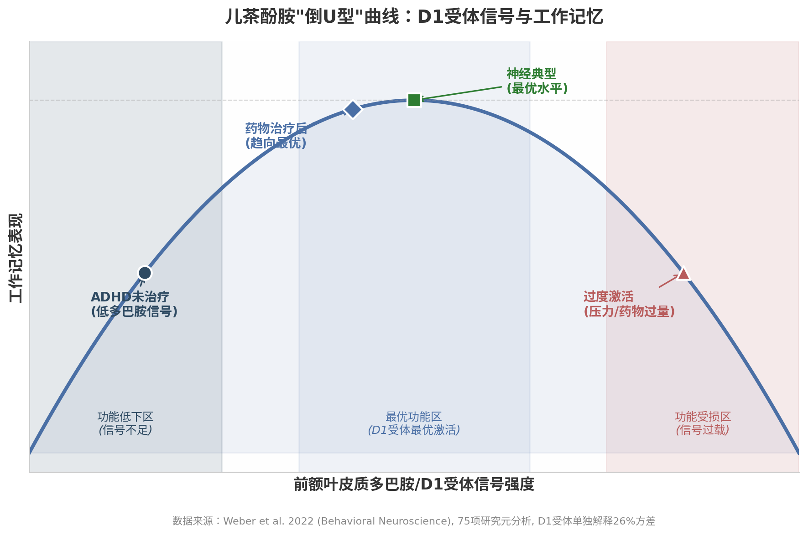

## 2. ADHD的神经科学基础

ADHD并非意志力薄弱或教养失当的产物，而是一种具有坚实神经生物学根基的发育障碍。过去二十年的神经影像学和分子药理学研究已经描绘出一幅清晰的图景：ADHD的核心病理涉及儿茶酚胺（catecholamine）——主要是多巴胺（dopamine）和去甲肾上腺素（norepinephrine）——在前额叶皮质（prefrontal cortex, PFC）和皮层下结构的调控失衡。这一神经科学基础不仅解释了ADHD患者为何在"重要但不有趣"的任务面前寸步难行，也为后续章节中超聚焦（hyperfocus）机制的探讨提供了理论前提：同一个多巴胺系统，在不足时导致注意力涣散，在过度激活时则可能造成不可自拔的深度沉浸。

### 2.1 多巴胺与去甲肾上腺素系统

#### 2.1.1 Volkow的里程碑PET研究

ADHD多巴胺假说最具说服力的直接证据来自Nora Volkow团队在布鲁克海文国家实验室开展的正电子发射断层扫描（positron emission tomography, PET）研究。2009年发表于*JAMA*的研究纳入53名从未用药的成人ADHD患者和44名健康对照，使用[¹¹C]raclopride（D2/D3受体标记物）和[¹¹C]cocaine（多巴胺转运体标记物）进行定量分析。结果显示，ADHD患者在伏隔核（nucleus accumbens）和中脑（midbrain）——多巴胺奖赏通路的核心节点——均表现出D2/D3受体和多巴胺转运体（dopamine transporter, DAT）可用性的显著降低[^1^]。2011年*Molecular Psychiatry*的后续分析进一步发现，这些多巴胺标记物的降低程度与注意力缺陷的严重程度呈显著负相关，且ADHD患者的成就动机量表得分显著低于对照组（11±5 vs. 14±3, P<0.001），多巴胺标记物与特质动机之间存在显著正相关（伏隔核D2/D3受体与成就动机：r=0.39, P<0.008）[^3^]。

这组研究的意义在于首次在人体中直接验证了ADHD的多巴胺奖赏通路功能障碍假说：并非ADHD患者"不想"努力，而是驱动努力的神经化学基础本身存在结构性缺陷。这也解释了为何外部奖惩对ADHD的激励效果远逊于神经典型者——当奖赏回路的受体密度和转运效率本就偏低时，同样的外部刺激在神经系统中产生的信号强度要弱得多。

然而，2024年*Frontiers in Psychiatry*的一篇系统性综述对该假说提出了重要修正：近期PET/SPECT研究的结果并不一致，既有报告多巴胺降低的研究，也有报告增加的发现，甚至出现无差异的结果[^12^]。研究者提出，这种表面上的矛盾可能通过"动态多巴胺活动"模型来调和——ADHD患者的基础性（tonic）多巴胺释放可能降低，但阶段性（phasic）多巴胺反应反而增强[^12^]。这一精细化的理解为靶向干预提供了更精确的靶点：问题可能不在于多巴胺的"总量"，而在于其时间动态模式。

#### 2.1.2 多巴胺转移缺陷理论

Tripp与Wickens于2008年提出的多巴胺转移缺陷理论（dopamine transfer deficit theory, DTD）为上述发现提供了机制层面的解释[^10^]。在正常强化学习过程中，中性线索（如铃声）通过与奖赏（如食物）的反复配对，逐渐获得预测性意义，多巴胺神经元的放电活动相应地从奖赏本身"转移"到预示奖赏的线索上。这种 anticipatory（预期性）多巴胺信号是动机产生的关键神经基础——它使个体在获得奖赏之前就产生行动的动力。

DTD理论的核心主张是：在ADHD中，这种多巴胺信号从奖赏向预测线索的转移过程受损[^9^]。即便奖赏与线索之间的关联已经被充分学习，ADHD患者仍无法在预期阶段产生足够的阶段性多巴胺反应，多巴胺信号依然"滞留"在实际奖赏出现时才释放[^10^]。这意味着ADHD大脑缺乏一种关键的"前瞻性动机"机制——无法被未来的、延迟的奖赏所驱动，只能对即时的、已经呈现的刺激产生反应。William Dodson提出的"兴趣导向神经系统"（interest-based nervous system）概念虽然未经严格的实证检验，却从临床现象学角度与DTD理论形成了呼应：ADHD患者并非无法被激励，而是只能被当下存在的新颖性、挑战性或紧迫感所激活，无法响应抽象的"重要性"或遥远的"奖赏"。

#### 2.1.3 去甲肾上腺素在前额叶皮质的作用

如果多巴胺是奖赏与动机的"燃料"，去甲肾上腺素则是前额叶皮质执行功能的"调节器"。前额叶皮质缺乏多巴胺转运体（DAT），多巴胺的再摄取主要由去甲肾上腺素转运体（norepinephrine transporter, NET）完成[^13^]。这一独特的神经解剖特征解释了为何选择性NET抑制剂——如托莫西汀（atomoxetine）——能够同时提升前额叶皮质中的去甲肾上腺素和多巴胺水平：通过阻断NET，托莫西汀阻止了两种神经递质的清除，从而增强前额叶的网络连接和认知功能[^13^]。

从功能角度看，多巴胺和去甲肾上腺素在前额叶皮质中扮演着互补角色：去甲肾上腺素通过激活α2A肾上腺素能受体增强神经元放电的"信号"强度，强化相关神经网络的连接；多巴胺则通过D1受体机制"修剪"不适当的连接，降低"噪声"[^18^]。Arnsten将这一机制概括为：去甲肾上腺素增强信号，多巴胺降低噪声，二者的最优平衡是前额叶执行功能正常运作的前提[^18^]。胍法辛（guanfacine）——一种α2A肾上腺素能激动剂——通过增强前额叶皮质的网络连接和神经元放电，已被证实可改善工作记忆和空间记忆任务表现，且这一效应在灵长类动物中尤为显著[^15^]。

#### 2.1.4 儿茶酚胺"倒U型"曲线

上述互补机制揭示了一个关键的剂量-效应关系：儿茶酚胺对前额叶皮质的调节遵循"倒U型"（inverted-U）曲线——中等水平的信号强度对应最优认知功能，而不足和过量均导致功能损害[^24^]。2022年*Behavioral Neuroscience*发表的一项纳入75项研究的元分析首次对这一曲线进行了定量验证：前额叶多巴胺与工作记忆表现之间确实存在负向二次曲线关系，多巴胺单独解释约10%的方差；而当聚焦于D1受体可用性时，倒U型拟合强度显著提升，单独解释26%的方差[^25^]。

这一发现具有深刻的临床意义：ADHD患者通常位于倒U型曲线的左侧（多巴胺信号不足），兴奋剂药物通过提升多巴胺水平将其推向最优区域；然而，如果剂量过高或个体对应激反应过度敏感，则可能滑向曲线右侧，反而损害认知功能。这也解释了为何兴奋剂治疗存在"最佳剂量窗"——并非越多越好，而是需要将儿茶酚胺水平精确调节至倒U型的峰值附近。

*图2-1* 展示了前额叶皮质多巴胺/D1受体信号强度与工作记忆表现之间的倒U型关系。ADHD未治疗患者通常位于曲线左侧（低多巴胺、低工作记忆表现），药物治疗将其推向最优区域，但过量则可能导致右侧功能下降。基于Weber等2022年75项研究的元分析数据，D1受体单独解释26%的方差[^25^]。

### 2.2 前额叶皮质与默认模式网络

#### 2.2.1 Shaw的发现：皮质成熟延迟

ADHD的神经发育特征并非简单的"结构异常"，而是一种时间维度上的偏移。Philip Shaw团队2007年在*PNAS*发表的里程碑研究追踪了223名ADHD儿童和223名对照的824次磁共振扫描，发现ADHD儿童达到皮质厚度峰值的中位年龄为10.5岁，显著晚于对照组的7.5岁——总体延迟约3年[^20^]。最关键的是，这种延迟在空间分布上并非均质的：前额叶皮质（负责执行控制、注意规划和运动抑制）的延迟最为显著，而初级运动皮质的成熟反而略有提前（ADHD 7.0岁 vs. 对照7.4岁）[^20^]。

Shaw等人强调，ADHD的皮质成熟模式呈现"延迟而非偏差"（delay rather than deviance）的特征——成熟区域的先后顺序与正常发育一致，只是整体节奏后移[^21^]。这与自闭症谱系障碍中观察到的"生长曲线偏移"（deviance）形成鲜明对比，提示两种疾病的神经发育机制存在本质差异。纵向随访进一步揭示，成年期症状持续者的前额叶皮质往往表现出"固定性"薄化（fixed thinning），而症状缓解者则趋向正常化[^22^]。这一发现为ADHD的异质性预后提供了神经解剖学基础：并非所有ADHD大脑都沿着相同的轨迹发展，部分个体存在更为持久的前额叶结构缺陷。

#### 2.2.2 默认模式网络的失调

在静息状态下，人脑存在一组彼此协同的脑区——默认模式网络（default mode network, DMN），在内省、自传体记忆和心智游移（mind-wandering）时活跃。在神经典型个体中，DMN与任务正向网络（task-positive networks, TPN）——如额顶网络（frontoparietal network）和腹侧注意网络（ventral attention network）——呈现"反相关"（anticorrelation）模式：执行任务时DMN被抑制，TPN增强；静息时则相反。Castellanos和Proal的元分析发现，ADHD患者在这一基本网络协调模式上存在系统性缺陷[^30^]。

2012年Cortese等在*American Journal of Psychiatry*发表的55项fMRI研究元分析确认，ADHD儿童在认知任务期间表现出DMN的过度激活，同时伴随额顶网络和腹侧注意网络的活动不足[^27^]。这意味着ADHD患者在试图专注时，DMN未能被充分"关闭"，内源性思维持续干扰任务加工——走神、白日梦和与任务无关的自发想法不断侵入意识。Castellanos与Aoki在2016年的综述中进一步提出，ADHD不应被理解为单一网络的功能障碍，而是多个网络（DMN、额顶控制网络、注意网络、突显网络）之间动态交互失调的结果[^30^]。

Silberstein等2016年的研究提供了重要药理学证据：哌甲酯（methylphenidate）能够显著降低ADHD患者在任务间歇期观察到的额顶功能连接增强，使其模式趋近于对照组[^29^]。这表明DMN失调并非不可逆转的结构损伤，而是可通过药物调节的功能状态。从超聚焦的角度理解，DMN失调的"反向极端"可能正是深度沉浸状态的神经基础：当某项活动足够吸引人时，DMN被充分抑制，任务网络获得前所未有的主导地位，从而产生近乎不可打断的专注状态。

#### 2.2.3 2024年NIH mega分析：深部脑结构连接

2024年3月，美国国立卫生研究院（NIH）团队在*American Journal of Psychiatry*发表了迄今最大规模的ADHD脑功能连接mega分析，重新分析了6个独立神经影像队列的超过10,000张fMRI图像，涵盖1,696名ADHD儿童和约7,000名对照[^43^]。研究发现，ADHD青少年在深部脑结构（尾状核caudate、壳核putamen、伏隔核nucleus accumbens）与额叶皮质之间存在显著增强的功能连接，且这一模式不受性别、年龄、种族、社会经济地位、智商估计值或共病焦虑/抑郁症状的影响[^43^]。

该研究的理论意义在于将皮层下-皮层连接异常确立为ADHD的一个可靠神经标志物。尾状核和壳核属于背侧纹状体，参与习惯形成和运动控制；伏隔核则是腹侧纹状体的核心奖赏加工中枢。深部结构与额叶皮质之间的过度连接可能构成了一种神经基质，使得奖赏信号不成比例地"捕获"并持续占用注意资源——这既能解释ADHD患者为何容易被即时刺激分心，也为理解超聚焦状态下的"锁定"现象（一旦某项高奖赏活动占据了注意系统便难以脱离）提供了回路层面的线索。然而，*Nature*的一篇同期评论审慎地指出，这些连接的效应量较小，"仅捕捉了ADHD复杂病理生理的一小部分"[^43^]——ADHD的神经基础远比单一连接异常更为复杂。

### 2.3 多缺陷模型

上述神经生物学发现共同指向一个核心结论：ADHD不存在单一的神经心理缺陷。不同患者在多巴胺系统、前额叶功能和网络协调等方面的受累程度各不相同，这要求我们必须放弃"一刀切"的理论框架，转向能够容纳异质性的多通路模型。

#### 2.3.1 双通路模型

Edmund Sonuga-Barke于2002年提出的双通路模型（dual pathway model）是整合执行功能与动机视角的重要理论框架[^33^]。该模型主张ADHD可通过两条独立的神经心理通路产生：第一条是**执行功能缺陷通路**（executive dysfunction pathway），源于中脑-皮层多巴胺通路（meso-cortical pathway）投射至前额叶皮质的功能紊乱，导致抑制控制、工作记忆和认知灵活性受损；第二条是**动机/延迟厌恶通路**（motivational/delay aversion pathway），与中脑-边缘多巴胺通路（meso-limbic pathway）投射至伏隔核的功能失调相关，表现为对延迟奖赏的过度厌恶和对即时反馈的病态偏好[^33^][^34^]。

这两条通路在神经回路、认知表型和遗传基础上均存在可辨识的差异。背侧纹状体-前额叶回路主要支持第一条通路，腹侧纹状体-边缘回路则支撑第二条通路。2020年*American Journal of Psychiatry*发表的一项纳入1,963名青少年的纵向神经影像研究为这一模型提供了直接证据：工作记忆和个体内反应变异性与后枕叶集群相关，而延迟折扣则独立于工作记忆与两个集群均有关联[^34^]。

下表对两种通路模型进行了系统对比：

| 维度 | 执行功能通路 | 动机/延迟厌恶通路 |
|:---|:---|:---|
| **多巴胺分支** | 中脑-皮层通路（meso-cortical） | 中脑-边缘通路（meso-limbic） |
| **核心脑区** | 前额叶皮质、背侧纹状体 | 伏隔核、腹侧纹状体、杏仁核 |
| **主要缺陷** | 抑制控制、工作记忆、认知灵活性 | 奖赏预期减弱、延迟厌恶、时间折扣陡峭 |
| **典型行为表现** | 组织困难、计划不足、易分心 | 冲动选择、缺乏耐心、逃避等待 |
| **关键检验任务** | Stroop任务、N-back、Go/No-Go | 延迟折扣任务（DDT）、选择延迟任务 |
| **药理学响应差异** | 对哌甲酯和托莫西汀均敏感 | 可能对多巴胺能药物响应更特异 |
| **占比估算** | 约50-60% ADHD儿童表现明显执行缺陷[^36^] | 约40% ADHD儿童表现延迟厌恶[^39^] |

*表2-1* Sonuga-Barke双通路模型的系统对比。两条通路在神经解剖、认知表型和临床特征上相对独立，为理解ADHD的异质性提供了理论框架。数据来源综合自[^33^][^34^][^36^][^39^]。

这一模型的核心启示在于：同样是符合DSM诊断标准的"ADHD"，其底层神经机制可能截然不同。一个以执行缺陷为主的儿童可能在结构性课堂中表现尚可（因为外部规则提供了补偿性支架），却在需要自主规划的任务中寸步难行；而一个以延迟厌恶为主的儿童可能拥有正常的工作记忆能力，却无法耐受任何缺乏即时反馈的活动。对前者的干预应聚焦于执行功能的训练和外部结构的搭建，对后者则需通过游戏化、即时奖励和缩短反馈循环来激活动机系统。

#### 2.3.2 三通路模型

双通路模型虽然具有较好的解释力，但无法涵盖ADDH患者在时间处理（temporal processing）方面的困难。2010年，Sonuga-Barke等在*Journal of the American Academy of Child & Adolescent Psychiatry*发表的实证研究支持将时间处理障碍作为第三条独立通路[^35^]。该研究对ADHD儿童进行了抑制控制、时间处理和延迟相关的神经心理学测试，发现三种缺陷的共现率不高于随机预期，且有相当比例的患者仅表现单一类型的问题[^35^]。

第三条通路涉及小脑-前额叶回路的功能障碍，主要影响时间感知和时间估计能力。小脑不仅协调运动 timing，也参与认知 timing 的调节；当这一系统受损时，个体难以准确预测"事件将在何时发生"，从而表现为时间盲症（time blindness）——对时间流逝的感知迟钝、对截止日期的距离感模糊、过度低估任务所需时长。Psych Scene Hub的三通路模型综述将这一通路概括为：背侧纹状体功能障碍影响"什么事件将要发生"的预测，腹侧纹状体障碍影响动机和奖赏加工，而小脑障碍则影响"事件何时发生"的时间判断[^38^]。

#### 2.3.3 ADHD的异质性：为什么"一刀切"方法必然失败

多通路模型最直接的临床推论是：ADHD的神经心理异质性意味着不存在普适性的干预策略。下表汇总了支持这一结论的关键数据：

| 研究 | 样本特征 | 核心发现 | 临床启示 |
|:---|:---|:---|:---|
| Sonuga-Barke双通路研究 | 儿童ADHD | 执行缺陷与延迟厌恶仅部分重叠，大量患者仅表现一种缺陷[^33^] | 同诊断患者可能需要截然不同的干预策略 |
| Exeter延迟厌恶研究 | ADHD儿童 | 仅~40%表现出临床显著的延迟厌恶，敏感性60-70%[^39^] | 延迟厌恶不能作为ADHD的普遍特征 |
| Van Lieshout等2016 | 成人ADHD | 11%的患者无任何可测得的神经心理功能缺陷[^41^] | 至少十分之一的患者认知功能完全正常 |
| Nigg 2005综述 | 综合文献 | 仅一部分ADHD患者存在执行功能缺陷，支持"多通路通向ADHD"假说[^36^] | 执行功能训练不应被视为通用方案 |
| Sonuga-Barke 2010 | ADHD儿童 | 时间处理、抑制控制和延迟缺陷三者共现率不高于随机预期[^35^] | 三通路之间相对独立，可单独出现 |

*表2-2* ADHD神经心理异质性的关键实证证据。综合多项研究数据，不同认知缺陷在ADHD患者中的分布呈现高度异质性。

Van Lieshout等2016年发表于*European Neuropsychopharmacology*的大型成人ADHD神经心理学研究尤其值得关注[^41^]。该研究发现，尽管ADHD成人群体总体上在执行功能和冲动性方面表现较差（效应量0.05-0.70），但**11%的患者的神经心理测试成绩完全处于正常范围**，最优预测模型的特异度为82.1%、敏感度仅64.9%[^41^]。这意味着：第一，相当比例的ADHD患者没有可客观测量的认知缺陷，他们的困难可能更多地源于动机调节或情绪管理；第二，现有的神经心理测试工具仅能正确识别约三分之二的ADHD患者，神经心理学正常并不能排除ADHD的诊断。

综合以上证据，ADHD的神经科学图景可以概括为：一种以儿茶酚胺系统调控失衡为核心、以前额叶皮质发育延迟和默认模式网络失调为系统表现、以多通路异质性为基本特征的神经发育障碍。这一认识为理解后续章节中的超聚焦现象奠定了双重基础——超聚焦既是多巴胺系统在特定条件下"过度激活"的极端表现，也是DMN被充分抑制后任务网络占据绝对主导的结果。而ADHD的异质性则预示着：并非所有ADHD个体都会以相同的方式或频率经历超聚焦，这取决于他们主要受累的是执行功能通路、动机通路还是时间处理通路。

